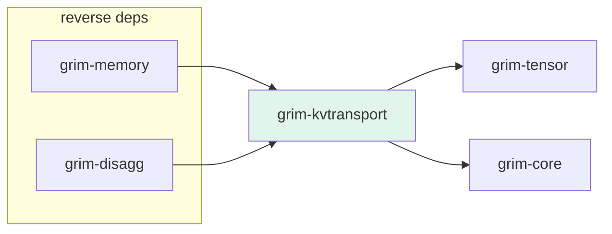

# grim-kvtransport

Tiered KV cache local transport and spillage (GPU → Host RAM → NVMe). §5.5.

## Purpose

Manages KV block data movement between storage tiers: GPU VRAM, Host RAM, and local NVMe scratch. Integrates with `grim-memory`'s `KvBlockPool` as the spill manager invoked when refcount-zero blocks need demotion. Also provides `NvmeWeightStreamer` for streaming model weights that exceed VRAM/DRAM, and `NetworkKvClient` for cross-node KV transfer in disaggregated scenarios.

## Boundaries

- Does **not** perform computation or compression — only data movement.
- Does **not** manage cache allocation — delegates to `grim-memory`.
- Does **not** define the `KvCache` trait — see `grim-core`.

## Dependency Graph



## Public API

```rust
pub type BlockId = usize;

pub enum CacheTier {
    Gpu,
    HostRam,
    NvMe,
    NvMeWeightStream, // NVMe weight-streaming layer
}

pub fn grimvise_advise(data: &[f32], advice: grim_tensor::MemAdvice) -> Result<()>;

pub struct LocalSpillManager {
    scratch_dir: PathBuf,
    block_tiers: HashMap<BlockId, CacheTier>,
    host_ram_cache: HashMap<BlockId, (Vec<f32>, Vec<f32>)>,
    nvme_cache: HashMap<BlockId, PathBuf>,
    block_elems: usize,
}

impl LocalSpillManager {
    pub fn new(scratch_dir: PathBuf, block_elems: usize) -> Result<Self>;
}

pub struct SharedSpillManager {
    inner: RwLock<LocalSpillManager>,
}

impl SharedSpillManager {
    pub fn new(scratch_dir: PathBuf, block_elems: usize) -> Result<Self>;
}

pub struct NetworkKvClient {
    pub local_ip: String,
}

impl NetworkKvClient {
    pub fn new(local_ip: String) -> Self;
}

pub struct NvmeWeightStreamer {
    pub lru_capacity_layers: usize,
    pub weights_path: PathBuf,
    // host_weight_cache + lru_order (private)
}
```

## Usage Example

```rust
use grim_kvtransport::{SharedSpillManager, CacheTier};
use std::path::PathBuf;

let spill = SharedSpillManager::new(
    PathBuf::from("/tmp/grim-spill"),
    16 * 32 * 64, // BLOCK_SIZE * num_heads * head_dim
)?;
```

## Feature Flags

This crate has no feature flags.

## Edge Cases, Limitations, and Quirks

- `LocalSpillManager` uses OS-level `madvise` on Linux/macOS to hint page residency — on Windows, `grimvise_advise` is a no-op.
- `NetworkKvClient` requires the local IP to match a network interface that can reach the target node — mismatched IPs produce connection errors at transfer time.
- `NvmeWeightStreamer` uses LRU eviction with configurable layer cache capacity — when the cache is full, the least-recently-used layer is evicted to the NVMe scratch file.
