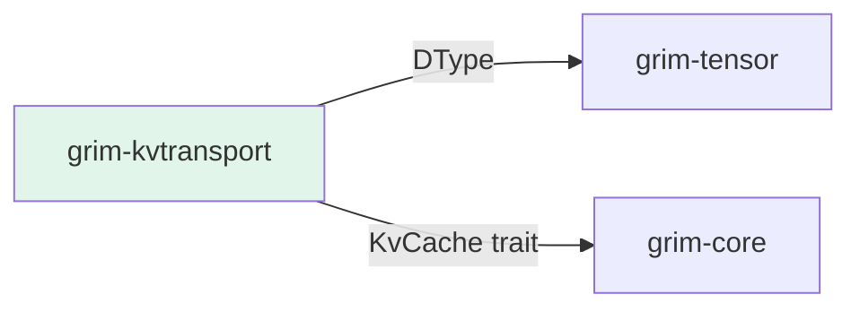

# grim-kvtransport

Tiered KV Cache local transport and spillage (GPU -> Host RAM -> NVMe). §5.5.

## Purpose

Manages KV cache data movement between storage tiers:
- GPU VRAM (fastest access)
- Host RAM (spill from GPU)
- NVMe SSD (spill from RAM for very large contexts)

Enables long-context inference by spillover to slower storage tiers.

## Boundaries

- Does not perform computation or compression
- Does not manage cache allocation — see `grim-memory`
- Does not define the KV cache interface — see `grim-core::KvCache`

## Dependency Graph



## Public API

### KvTransportOp

```rust
pub enum KvTransportOp {
    GpuToHost { block_id: BlockId, offset: usize, len: usize },
    HostToGpu { block_id: BlockId, offset: usize, len: usize },
    SpillToNvme { block_id: BlockId, path: PathBuf },
    LoadFromNvme { block_id: BlockId, path: PathBuf },
}
```

### TieredAccessor

Manages data movement between storage tiers with caching.

## Usage Example

```rust
use grim_kvtransport::TieredAccessor;

let accessor = TieredAccessor::new();
let k_bytes = accessor.load_kv_block(&block_id, BlockType::K, current_tier);
```

## Feature Flags

This crate has no feature flags.

## Edge Cases

1. **NUMA awareness**: Transfers may prefer specific NUMA nodes
2. **Page alignment**: NVMe spill files use aligned page sizes
3. **Compression**: Spilled data may be compressed before write