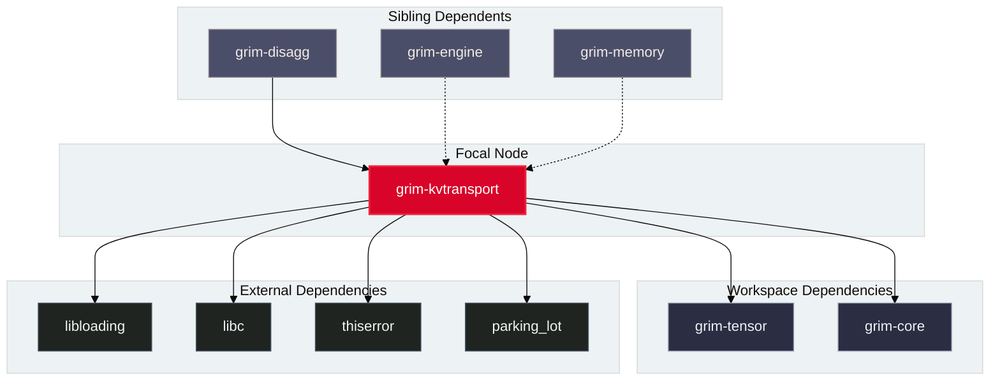

# grim-kvtransport

## Purpose

`grim-kvtransport` provides the tiered KV cache transport, local NVMe spillage, direct GPU-to-NVMe DMA (GDS / hipFile), and network wire protocols for moving KV cache blocks between GPU VRAM, host system memory, and storage tiers.

## Boundaries

`grim-kvtransport` does **not**:
- Allocate or manage GPU page tables and radix prefix trees (delegated to `grim-memory`).
- Decide cluster-level prefill/decode routing policies (delegated to `grim-disagg`).
- Quantize or dequantize KV cache tensor blocks (delegated to `grim-kvquant`).

## Dependency Graph



## Public API Overview

Exposed from `src/lib.rs`:

```rust
/// Tiered local storage manager for spilling KV blocks between RAM and NVMe.
pub struct LocalSpillManager {
    // ...
}

/// Dynamic FFI loader for AMD hipFile / GPUDirect Storage driver libraries.
pub struct HipFileLib {
    // ...
}

impl HipFileLib {
    pub fn open() -> Result<Self, Error>;
}

/// Direct GPU-to-NVMe DMA storage tier with automatic CPU bounce-buffer fallback.
pub struct GdsTier {
    // ...
}

impl GdsTier {
    pub fn new(root_dir: std::path::PathBuf) -> Result<Self, Error>;
    pub fn write_block(&self, block_id: u64, dev_ptr: *const std::ffi::c_void, bytes: usize) -> Result<(), Error>;
    pub fn read_block(&self, block_id: u64, dev_ptr: *mut std::ffi::c_void, bytes: usize) -> Result<(), Error>;
    pub fn is_gds_active(&self) -> bool;
}

/// Abstract storage trait decoupling transport workers from memory pools.
pub trait KvBlockStore: Send + Sync {
    fn store_block(&self, block_id: u64, k: Vec<f32>, v: Vec<f32>) -> Result<(), Error>;
    fn load_block(&self, block_id: u64) -> Result<Option<(Vec<f32>, Vec<f32>)>, Error>;
}

/// TCP network client for cross-node binary block transport.
pub struct NetworkKvClient {
    // ...
}
```

## Usage Example

```rust
use grim_kvtransport::GdsTier;
use std::path::PathBuf;

fn main() -> Result<(), Box<dyn std::error::Error>> {
    let tier = GdsTier::new(PathBuf::from("/tmp/grim-gds"))?;
    println!("GDS Active direct DMA: {}", tier.is_gds_active());

    // When GDS is unavailable or running without root/cufile permissions,
    // GdsTier automatically handles writes and reads via host staging fallbacks.
    Ok(())
}
```

## Use Cases

- Direct DMA transfer between NVMe SSDs and AMD GPU VRAM bypassing CPU host RAM.
- Local multi-tier spilling of cold KV blocks to system RAM and NVMe when GPU VRAM budget is exhausted.
- Synchronizing KV blocks between prefill and decode worker nodes in distributed deployments.

## Edge Cases, Limitations, and Quirks

1. **GDS Dynamic Driver Discovery**: If `libhipfile.so` or `/dev/cufile` is absent, `GdsTier` transparently falls back to posix file reads and host-to-device memory copies without failing.
2. **Alignment Constraints**: True GPUDirect DMA requires 4 KB sector-aligned disk offsets and memory addresses.
3. **Platform Availability**: Direct `madvise` and GDS APIs operate on Linux systems; on non-Linux platforms, operations fall back to portable file I/O.

## Build Flags, Feature Flags, and Environment Variables

- `default`: No special features.
- **Environment variables**: `GRIM_GDS_DISABLE` (forces CPU fallback mode).
