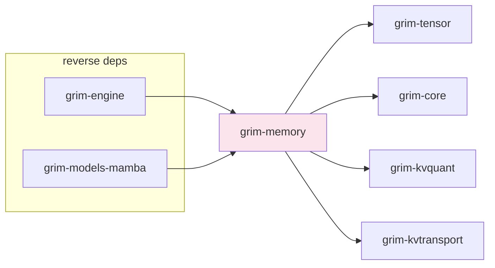

# grim-memory

Paged KV cache with logical block tables, prefix sharing, multi-tier spilling, and block-pool ref-counting.

## Purpose

Manages GPU memory for attention key/value caches. Provides `PagedKvCache` (the `KvCache` trait implementation used by `grim-engine` sessions), `KvBlockPool` (shared physical block pool with ref-counting), `BlockTable` (logical-to-physical mapping), and integration with `grim-kvtransport` for multi-tier spilling (GPU → host RAM → NVMe) and `grim-kvquant` for KV compression.

## Boundaries

- Does **not** perform tensor computation — only memory management.
- Does **not** define the `KvCache` trait — that is in `grim-core`.
- Does **not** handle model loading — see `grim-format`.

## Dependency Graph



## Public API

```rust
pub const BLOCK_SIZE: usize = 16;
pub type BlockId = usize;

pub struct DemotionRecord {
    pub block_id: BlockId,
    pub from_tier: grim_kvtransport::CacheTier,
    pub to_tier: grim_kvtransport::CacheTier,
    pub bytes_freed: usize,
    pub bytes_consumed: usize,
}

pub struct KvBlockPool {
    blocks: Vec<KvBlock>,
    free_list: VecDeque<BlockId>,
    ref_counts: HashMap<BlockId, u32>,
    prefix_cache: HashMap<u64, BlockId>,
}

impl KvBlockPool {
    pub fn new(num_blocks: usize, block_size: usize, ...) -> Self;
    pub fn allocate(&mut self) -> Option<BlockId>;
    pub fn free(&mut self, id: BlockId);
    pub fn free_with_tier(&mut self, id: BlockId, force_tier: bool) -> Result<()>;
    pub fn ref_block(&mut self, id: BlockId);
    pub fn deref_block(&mut self, id: BlockId);
    pub fn find_or_share_prefix(&mut self, hash: u64) -> Option<BlockId>;
}

pub struct BlockTable {
    pub logical_to_physical: Vec<BlockId>,
}

impl BlockTable {
    pub fn new() -> Self;
    pub fn physical_len(&self) -> usize;
    pub fn allocate(&mut self, pool: &mut KvBlockPool) -> Result<BlockId>;
}

pub struct PagedKvCache { /* fields */ }

impl PagedKvCache {
    pub fn new(num_heads: usize, head_dim: usize,
               block_pool: Arc<Mutex<KvBlockPool>>) -> Self;
    pub fn rollback_to(&mut self, len: usize) -> Result<()>;
}

pub type KvTransportId = grim_kvtransport::TransportBlockId;
```

## Usage Example

```rust
use grim_memory::{KvBlockPool, PagedKvCache, BLOCK_SIZE};
use std::sync::{Arc, Mutex};

let pool = Arc::new(Mutex::new(
    KvBlockPool::new(256, BLOCK_SIZE, num_heads, head_dim)));
let cache = PagedKvCache::new(num_heads, head_dim, pool.clone());
```

## Feature Flags

This crate has no feature flags.

## Edge Cases, Limitations, and Quirks

- `BLOCK_SIZE` is 16 tokens — KV blocks are allocated in fixed 16-token chunks.
- Ref-counting: `free_with_tier` decrements the refcount and only removes the block from the pool when it reaches zero — blocks shared via prefix cache stay alive while referenced.
- `rollback_to(0)` frees all physical blocks for the requesting session, but shared blocks (other active requests via prefix cache) are preserved by ref-counting.
- Multi-tier spilling: when VRAM pressure is high, refcount-zero blocks are demoted to host RAM, then to NVMe, before the GPU copy is released.
