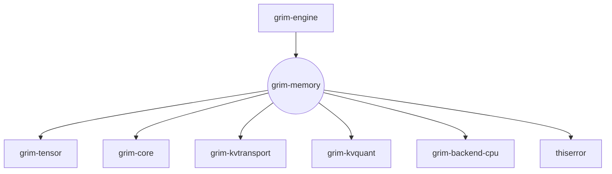

# grim-memory

## Purpose
The `grim-memory` crate handles the lifecycle, allocation, and multi-tier spilling of Key-Value (KV) cache memory. It implements the `KvCache` trait from `grim-core`, providing a `PagedKvCache` that supports logical block tables, prefix sharing, and integration with `grim-kvtransport` for demoting unused blocks to Host RAM or NVMe storage.

## Boundaries
This crate concerns itself solely with *memory management* of the KV state. It tracks logical-to-physical block mappings, refcounts, and offload orchestration. It does *not* perform attention computation, tensor algebra, or network layer RPCs (though it invokes transport interfaces for spilling). 

## Dependency Graph


## Public API Overview
- **`PagedKvCache`**: The primary implementation of `grim_core::kv_cache::KvCache`, managing tentative (speculative) and committed tokens.
- **`KvBlockPool`**: A pre-allocated shared pool of physical blocks. Handles refcounting, prefix cache hashes, block allocation, and SSM state pools.
- **`BlockTable`**: Maps a sequence's logical blocks to the physical block IDs in the pool.
- **Tier Spilling Hooks**: `attach_spill` and `attach_compressor` on the `KvBlockPool` to wire in compression and NVMe/RAM demotion.
- **`moe_budget::*`**: Budget tracking for MoE resident-set HBM constraints (`MoeResidentBudget`).

## Usage Example
```rust
use grim_memory::{KvBlockPool, PagedKvCache};
use grim_core::kv_cache::KvCache;
use std::sync::{Arc, Mutex};

fn setup_cache() {
    let num_heads = 32;
    let head_dim = 128;
    let capacity_blocks = 1024;
    
    // Create physical pool
    let pool = Arc::new(Mutex::new(KvBlockPool::new(
        capacity_blocks,
        num_heads,
        head_dim
    )));
    
    // Create a logical sequence cache
    let mut seq_cache = PagedKvCache::new(pool.clone(), num_heads, head_dim);
    
    // Append a slot and commit tokens
    seq_cache.append_slot().unwrap();
    seq_cache.commit(1).unwrap();
    
    println!("Sequence length: {}", seq_cache.len());
}
```

## Use Cases
- Allocating continuous token context during LLM text generation.
- Speculative decoding workflows where tokens are tentatively appended and then rolled back (`rollback_to`) if speculation fails.
- Reusing context windows across requests via prefix caching (sharing physical blocks for matching prompt hashes).
- Evicting old KV blocks to NVMe when GPU HBM fills up during heavy server load.

## Edge Cases, Limitations, and Quirks
- **Block Granularity Truncation**: When rolling back or truncating block tables, the `truncate` logic operates strictly on *block counts*, not token counts. Tentative/speculative tokens must be managed carefully so partial blocks are aligned correctly.
- **Zero Content Optimization**: Blocks in the pool track a `received` boolean. An all-zero block might genuinely be received data rather than an uninitialized state, bypassing fragile content-sniffing heuristics.

## Build Flags, Feature Flags, and Environment Variables
- **Features**: 
  - `default = []`
  - `rocm-aiter`: Alters internal configuration to use a block-major layout, optimizing LDS accesses on ROCm hardware.
- **Dev-Dependencies**: Uses `tempfile` for testing NVMe spill behaviors.
