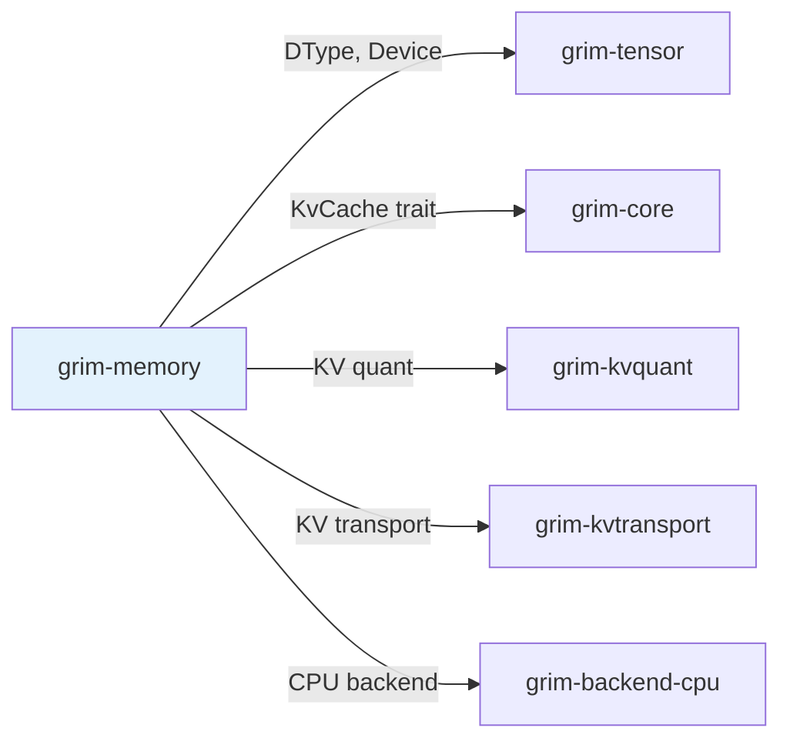

# grim-memory

Paged KV cache, block allocator, prefix cache, and SSM state pool for Grim. Implements the KvCache trait from grim-core.

## Purpose

Manages key-value cache storage for autoregressive inference:
- Paged allocation with block pools
- Prefix caching for shared prefix optimization
- SSM state pool for Mamba/State-space models

## Boundaries

- Does not perform inference — only manages cache storage
- Does not define the KV cache interface — see `grim-core::KvCache` trait
- Does not handle network transport — see `grim-kvtransport`

## Dependency Graph



## Public API

### KvBlockPool

```rust
pub struct KvBlockPool {
    // Paged block allocator for KV cache
}

impl KvBlockPool {
    pub fn new(capacity: usize, num_kv_heads: usize, head_dim: usize) -> Self;
    pub fn used_count(&self) -> usize;
    pub fn capacity(&self) -> usize;
    pub fn block_bytes(&self) -> usize;
    pub fn alloc(&mut self, num_blocks: usize) -> Result<Option<Vec<BlockId>>>;
    pub fn free(&mut self, blocks: &[BlockId]);
}
```

### PrefixCache

Implements token-level prefix caching to share KV state across requests with common prompts.

### SsmStatePool

Manages state for SSM (State Space Model) architectures like Mamba.

## Usage Example

```rust
use grim_memory::KvBlockPool;

let pool = KvBlockPool::new(1024, 32, 128);
let (used, total, blocks_used, blocks_total) = pool.telemetry();
```

## Feature Flags

| Flag | Default | Description |
|---|---|---|
| rocm-aiter | - | Enable ROCm AiTensor kernel tests |

## Edge Cases

1. **Demote-before-drop**: Eviction policy prefers demoting to CPU before dropping
2. **Prefix cache invalidation**: Cleared when model weights change
3. **Block fragmentation**: Large requests may require multiple block allocations