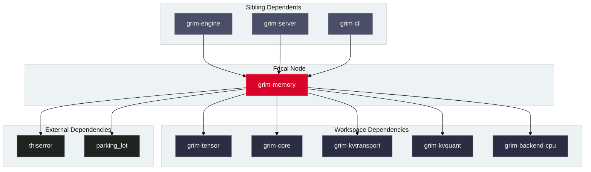

# grim-memory

## Purpose

`grim-memory` manages the lifecycle, allocation, prefix tree caching, MoE expert double-buffering, and multi-tier spilling of Key-Value (KV) cache memory. It implements logical-to-physical block tables, prompt prefix sharing, and radix matching for dynamic prefix reuse across sequence requests.

## Boundaries

`grim-memory` does **not**:
- Execute tensor attention matrix multiplication or compute kernels (delegated to backend crates).
- Perform physical network I/O or inter-node migrations (delegated to `grim-kvtransport` and `grim-disagg`).
- Implement continuous sequence batching scheduling algorithms (delegated to `grim-scheduler`).

## Dependency Graph



## Public API Overview

Exposed from `src/lib.rs`:

```rust
/// Primary implementation of the KvCache trait managing physical block tables.
pub struct PagedKvCache {
    // ...
}

/// Pre-allocated shared pool of physical blocks with refcounting and prefix hashing.
pub struct KvBlockPool {
    // ...
}

/// Dynamic prefix matching and blending result for partial cache reuse.
#[derive(Debug, Clone, PartialEq, Eq)]
pub struct PrefixMatchResult {
    pub matched_tokens: usize,
    pub block_ids: Vec<u64>,
    pub requires_blending: bool,
    pub divergence_token: usize,
}

/// Match prompt tokens against radix prefix cache with support for partial block blending.
pub fn match_prefix_blending(
    prompt_tokens: &[u32],
    cached_blocks: &[(u64, Vec<u32>)],
    block_size: usize,
) -> PrefixMatchResult;

/// Double-buffered MoE offload cache overlapping host-to-device transfers with compute.
pub struct OffloadMoeCache {
    // ...
}

impl OffloadMoeCache {
    pub fn new(capacity_slots: usize) -> Self;
    pub fn swap_buffers(&mut self);
    pub fn stage_expert(&mut self, expert_id: usize) -> Option<usize>;
    pub fn active_expert_slot(&self, expert_id: usize) -> Option<usize>;
}
```

## Usage Example

```rust
use grim_memory::{match_prefix_blending, OffloadMoeCache};

fn main() {
    let block_size = 16;
    let block0_tokens = (0..16).collect::<Vec<u32>>();
    let cached_blocks = vec![(100u64, block0_tokens)];

    // Prompt matches first 12 tokens, then diverges
    let mut prompt = (0..12).collect::<Vec<u32>>();
    prompt.extend_from_slice(&[999, 998, 997, 996]);

    let res = match_prefix_blending(&prompt, &cached_blocks, block_size);
    assert_eq!(res.matched_tokens, 12);
    assert!(res.requires_blending);
    assert_eq!(res.divergence_token, 12);

    // Double-buffered MoE cache timeline overlap
    let mut moe_cache = OffloadMoeCache::new(4);
    let stage_slot = moe_cache.stage_expert(42).unwrap();
    moe_cache.swap_buffers();
    assert_eq!(moe_cache.active_expert_slot(42), Some(stage_slot));
}
```

## Use Cases

- Managing continuous PagedAttention token blocks during LLM prefill and autoregressive decode.
- Reusing KV cache blocks across prompt variations using radix prefix caching with partial block blending.
- Double-buffered ping-pong buffer management for offloading massive MoE expert banks over PCIe without execution stalls.

## Edge Cases, Limitations, and Quirks

1. **Prefix Blending Threshold**: `match_prefix_blending` flags `requires_blending = true` only when divergence occurs mid-block; exact whole-block matches return `requires_blending = false`.
2. **Block Table Truncation**: Rolling back speculative tokens truncates logical block allocations on block boundaries while maintaining reference counts on shared prefix nodes.

## Build Flags, Feature Flags, and Environment Variables

- `default`: No special features.
- `rocm-aiter`: Enables block-major memory layout optimizations for AMD ROCm LDS access patterns.
