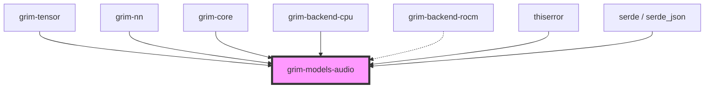

# grim-models-audio

## Purpose
Audio model architectures for Grim, covering the four families present in the
reference checkpoint library (`models/audio/`):

| Module | Family | Trait (grim-core) | ModalityHint | Reference checkpoints |
|---|---|---|---|---|
| `whisper` | ASR encoder-decoder | `EncoderDecoderLm` | `AudioEncoderDecoder` | Whisper-family GGUF/HF |
| `kokoro` | TTS (StyleTTS2 + iSTFTNet + PLBert) | `TextToSpeechModel` | `TextToSpeech` | `Kokoro-82m` |
| `meanvc2` | Voice conversion (DiT + conditional flow matching) | `VoiceConversionModel` | `VoiceConversion` | `MeanVC2` (`model_type: "DiT"`) |
| `vocos` | Neural vocoder (ConvNeXt + iSTFT head) | `AudioVocoder` | `AudioVocoder` | `MeanVC2/vocos.pt`, WavTokenizer decoder family |

## Boundaries
- Defines the architecture for transforming audio spectrograms into tokens,
  phonemes into waveforms, and mel features into audio.
- Does not handle audio file parsing or spectrogram generation directly (assumes tensor inputs).
- Each model implements its capability trait; only Whisper is an
  `EncoderDecoderLm`. TTS/VC/vocoder models are non-autoregressive and do not
  masquerade as `CausalLm`.

## Dependency Graph


## Public API Overview
- **Model Structs:** `Whisper`, `Kokoro`, `MeanVC2`, `Vocos`.
- **Configurations:** `WhisperConfig`, `KokoroConfig`, `MeanVC2Config`, `VocosConfig`.
- All configs are serde-serializable. `WhisperConfig::from_hf` accepts both
  HuggingFace transformers keys (`d_model`, `encoder_layers`, …) and OpenAI's
  original Whisper keys (`n_audio_state`, `n_audio_layer`, …); missing fields
  fall back to whisper-tiny defaults.

## Usage Example
```rust
use grim_models_audio::{Whisper, WhisperConfig};
// Intended for inference with Whisper models using EncoderDecoderLm trait methods.
```

## Use Cases
- Automatic Speech Recognition (ASR) via Whisper and derivatives.
- Text-to-speech synthesis via Kokoro/StyleTTS2.
- Zero-shot voice conversion via MeanVC2-style DiT flow matching.
- Mel-to-audio synthesis via Vocos/iSTFT vocoders.

## Edge Cases, Limitations, and Quirks
- The Whisper encoder requires Mel spectrogram tensors with specific feature dimensions and sequence lengths depending on the Whisper variant.
- `Whisper::decode_step` enforces `max_text_len`; `encode` enforces `n_mels`
  and `max_audio_len`.
- Weight loading for Kokoro/MeanVC2/Vocos from `.pth` (torch pickle) and
  JIT-traced `.pt` archives is not implemented — those formats need a torch
  pickle reader in `grim-format` before the reference checkpoints can load
  directly. Safetensors (e.g. `meanvc2_*.safetensors`) flows through the
  standard provider path.

## Build Flags, Feature Flags, and Environment Variables
- `default`: No special features.
- `rocm`: Enables `grim-backend-rocm` for GPU operations (Whisper decoder
  cross-attention dispatches to `BackendDevice::cross_attention`).

## Cross-Crate Compatibility Notes
- `grim-core`: `ModelArchitecture::{Whisper, Kokoro, StyleTts2, Vocos, DiT}`
  parse the reference configs' `model_type` strings and route to the matching
  `ModalityHint`.
- `grim-engine`: `Engine::register_model` preserves each model's own
  modality hint instead of forcing `TextInTextOut`.
- `grim-server`: `/v1/audio/speech` serves loaded `Kokoro` models;
  `/v1/audio/transcriptions` and `/v1/audio/translations` gate on a loaded
  `Whisper`. Full ASR decode-through (mel front-end → tokens) remains unwired.
