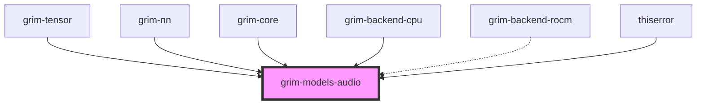

# grim-models-audio

## Purpose
Provides an audio encoder-decoder architecture implementation for Grim, focusing on Whisper-style speech recognition. It implements the `EncoderDecoderLm` trait defined in `grim-core`.

## Boundaries
- Defines the architecture for transforming audio spectrograms into tokens.
- Does not handle audio file parsing or spectrogram generation directly (assumes tensor inputs).
- Operates strictly on `EncoderDecoderLm` paradigms rather than causal language modeling.

## Dependency Graph


## Public API Overview
- **Model Structs:** `Whisper`.
- **Configurations:** `WhisperConfig`.

## Usage Example
```rust
use grim_models_audio::{Whisper, WhisperConfig};
// Intended for inference with Whisper models using EncoderDecoderLm trait methods.
```

## Use Cases
- Automatic Speech Recognition (ASR) via Whisper and derivatives.
- Audio-to-text generation tasks within the Grim ecosystem.

## Edge Cases, Limitations, and Quirks
- The encoder requires Mel spectrogram tensors with specific feature dimensions and sequence lengths depending on the Whisper variant.

## Build Flags, Feature Flags, and Environment Variables
- `default`: No special features.
- `rocm`: Enables `grim-backend-rocm` for GPU operations.
