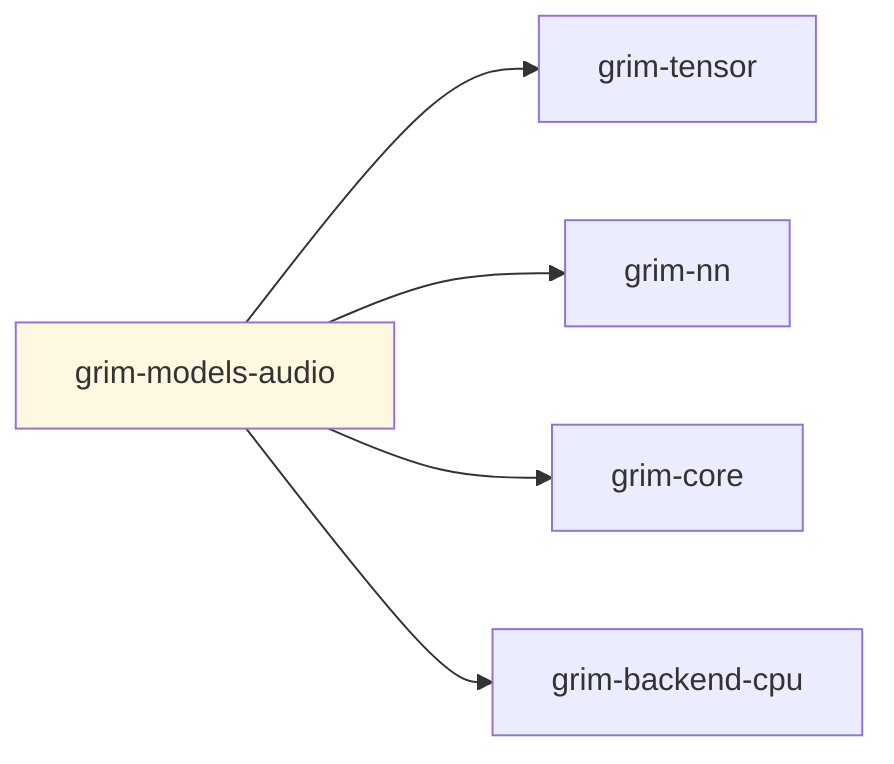

# grim-models-audio

Audio encoder-decoder (Whisper-style) for Grim — implements `EncoderDecoderLm` from `grim-core`.

## Purpose

Provides the `Whisper` model struct and `WhisperConfig` — an encoder-decoder transformer for speech tasks. The encoder processes audio features (mel-spectrogram tokens), the decoder generates text tokens.

## Boundaries

- Does **not** handle raw audio file I/O — callers provide token IDs.
- Does **not** implement ASR directly — converts audio token sequences to text token sequences.
- Does **not** manage KV cache directly — delegates to `grim-core`'s `KvCache` trait via the decoder.

## Dependency Graph



## Public API

```rust
pub use whisper::{Whisper, WhisperConfig};

pub struct WhisperConfig {
    pub vocab_size: usize,
    pub n_mels: usize,
    pub d_model: usize,
    pub num_enc_layers: usize,
    pub num_dec_layers: usize,
    // ... additional config fields
}

pub struct Whisper {
    pub cfg: WhisperConfig,
    pub device: grim_tensor::Device,
    // encoder + decoder weights
}

impl Whisper {
    pub fn new(device: grim_tensor::Device, cfg: WhisperConfig) -> Self;
}

impl grim_core::model::EncoderDecoderLm for Whisper {
    // encode() + decode() via the Model trait
}
```

## Feature Flags

| Flag | Default | Description |
|---|---|---|
| `rocm` | no | Enable ROCm backend |

## Usage Example

```rust
use grim_models_audio::{Whisper, WhisperConfig};
use grim_tensor::Device;

let cfg = WhisperConfig {
    vocab_size: 51865,
    n_mels: 80,
    d_model: 1024,
    num_enc_layers: 12,
    num_dec_layers: 12,
};
let model = Whisper::new(Device::Cpu, cfg);
```
