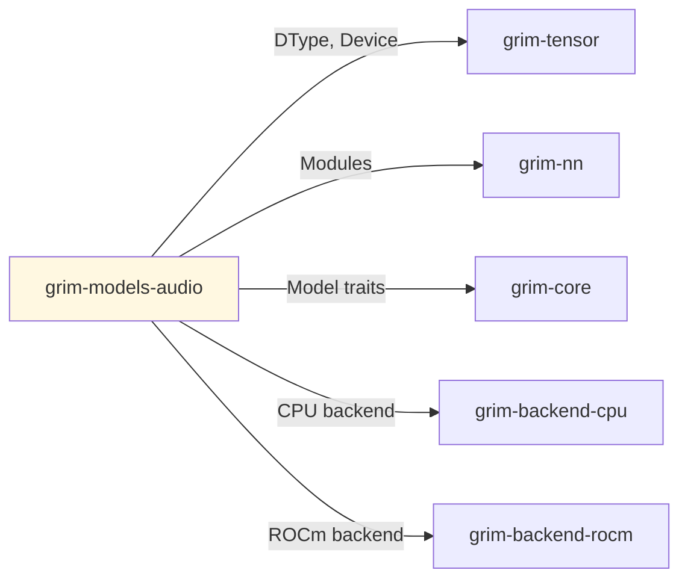

# grim-models-audio

Audio encoder-decoder (Whisper-style) for Grim — implements EncoderDecoderLm per §4.4.

## Purpose

Implements audio encoder-decoder architecture for speech processing:
- Whisper-style transformer encoder for audio features
- Causal LM decoder for token generation
- Mel-spectrogram preprocessing

## Boundaries

- Does not handle raw audio I/O — expects token IDs
- Does not manage KV cache — that's `grim-core::KvCache`
- Does not implement ASR — converts audio to text tokens

## Dependency Graph



## Public API

### WhisperModel

```rust
pub struct WhisperModel {
    pub encoder: AudioEncoder,
    pub decoder: CausalLm,
}

impl EncoderDecoderLm for WhisperModel { /* ... */ }

pub struct AudioEncoder {
    pub conv_in: Conv1D,
    pub embed: PositionalEmbedding,
    pub layers: Vec<TransformerBlock>,
    pub conv_out: Conv1D,
}
```

## Usage Example

```rust
use grim_models_audio::WhisperModel;

let model = WhisperModel::new(
    vocab_size: 51865,
    hidden_dim: 1024,
    encoder_layers: 12,
    decoder_layers: 12,
);
```

## Feature Flags

| Flag | Default | Description |
|---|---|---|
| rocm | - | Enable ROCm backend |

## Edge Cases

1. **Encoder-decoder attention**: Cross-attention in decoder
2. **Positional encoding**: Learned positional embeddings for encoder
3. **No KV cache**: Audio transcription is single-pass in encoder