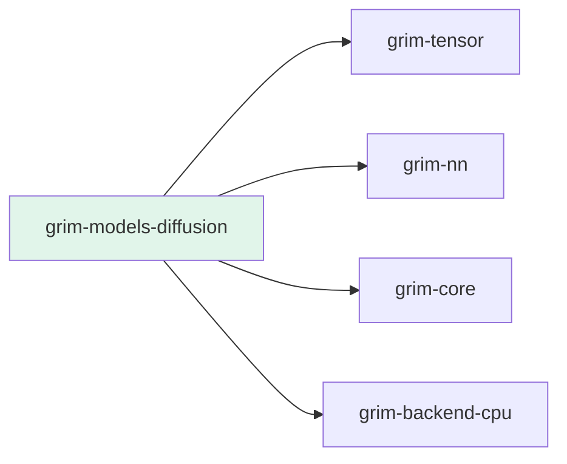

# grim-models-diffusion

Diffusion model (UNet + DDIM/Euler noise schedulers) for Grim — implements `DiffusionModel` from `grim-core`.

## Purpose

Provides `Unet2D` for latent diffusion denoising and `DdimScheduler` / `EulerScheduler` for the step loop. The noise scheduler owns a sequence of denoising steps; each step takes predicted noise from the model and produces the next latent state.

## Boundaries

- Does **not** perform image generation end-to-end — only denoising of latent tensors.
- Does **not** implement VAE encoding/decoding — callers provide latents.
- Does **not** handle model loading — see `grim-format`.

## Dependency Graph



## Public API

```rust
pub use unet::{Unet2D, UnetConfig};
pub use scheduler::{DdimScheduler, EulerScheduler};

pub struct UnetConfig {
    pub in_channels: usize,
    pub out_channels: usize,
    pub hidden: usize,
    pub num_downsample: usize,
    pub rms_norm_eps: f32,
}

pub struct Unet2D {
    pub cfg: UnetConfig,
    pub device: grim_tensor::Device,
    // down/mid/up blocks
}

impl Unet2D {
    pub fn new(device: grim_tensor::Device, cfg: UnetConfig) -> Self;
}

impl grim_core::model::DiffusionModel for Unet2D {
    fn load(&mut self, weights: &mut impl TensorProvider) -> Result<()>;
}
```

```rust
// From grim-core::model
pub trait NoiseScheduler: Send + Sync {
    fn step(&self, model_output: &Tensor, t: u32, x: &Tensor) -> Result<Tensor>;
}

pub struct DdimScheduler { /* fields */ }
impl DdimScheduler {
    pub fn new(timesteps: Vec<u32>, alphas_cumprod: Vec<f32>) -> Self;
    pub fn linear(num_steps: usize, beta_start: f32, beta_end: f32) -> Self;
}

pub struct EulerScheduler { /* fields */ }
impl EulerScheduler {
    pub fn from_betas(betas: Vec<f32>) -> Self;
}
```

## Feature Flags

This crate has no feature flags.

## Usage Example

```rust
use grim_models_diffusion::{Unet2D, UnetConfig, DdimScheduler};
use grim_tensor::Device;

let cfg = UnetConfig {
    in_channels: 4,
    out_channels: 4,
    hidden: 128,
    num_downsample: 3,
    rms_norm_eps: 1e-5,
};
let model = Unet2D::new(Device::Cpu, cfg);
let scheduler = DdimScheduler::linear(50, 0.0001, 0.02);
```
