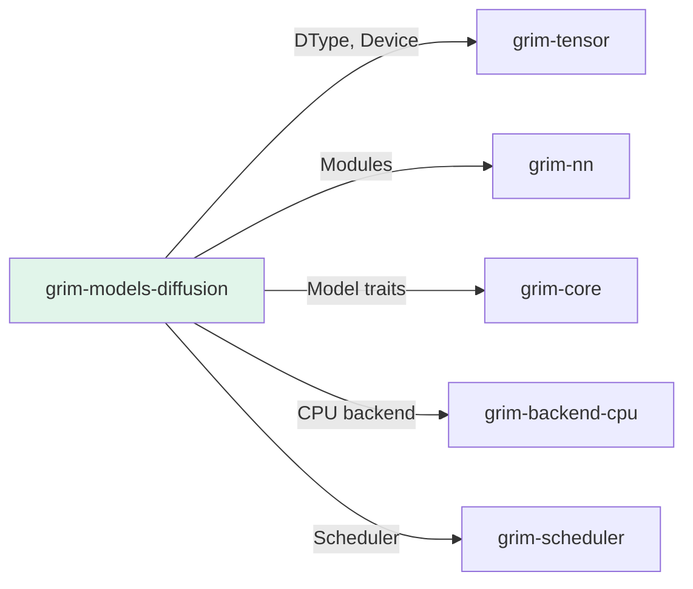

# grim-models-diffusion

Diffusion model (UNet + DDIM/Euler noise schedulers) for Grim — implements DiffusionModel per §4.4.

## Purpose

Implements diffusion model architecture for image generation:
- UNet backbone for denoising
- DDIM and Euler sampler schedulers
- Time embedding for step-aware processing

## Boundaries

- Does not perform image generation — only denoises latents
- Does not manage VAE encoding/decoding
- Does not handle model loading — see `grim-format`

## Dependency Graph



## Public API

### DiffusionUNet

```rust
pub struct DiffusionUNet {
    pub time_embed: TimestepEmbedding,
    pub down_blocks: Vec<UNetBlock>,
    pub mid_block: UNetBlock,
    pub up_blocks: Vec<UNetBlock>,
    pub out: Sequential,
}

impl DiffusionModel for DiffusionUNet {
    fn denoise(&self, latents: &Tensor, t: u32, context: Option<&Tensor>) -> Result<Tensor>;
}
```

### NoiseScheduler

```rust
pub trait NoiseScheduler {
    fn step(&self, model_output: &Tensor, t: u32, x: &Tensor) -> Result<Tensor>;
    fn sigmas(&self, num_steps: usize) -> Vec<f32>;
}

pub struct DDIMScheduler { /* ... */ }
pub struct EulerScheduler { /* ... */ }
```

## Usage Example

```rust
use grim_models_diffusion::{DiffusionUNet, DDIMScheduler};

let unet = DiffusionUNet::new(
    in_channels: 4,
    out_channels: 4,
    hidden_dim: 128,
    num_layers: 4,
);

let scheduler = DDIMScheduler::new(num_steps: 50);
```

## Feature Flags

This crate has no feature flags.

## Edge Cases

1. **Cross-attention**: Conditions on text embeddings via context
2. **Time embedding**: Sine/cosine positional encoding for timestep
3. **Variance**: DDIM scheduler supports optional variance learning