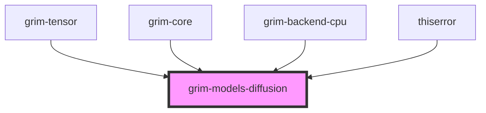

# grim-models-diffusion

## Purpose
Implements UNet/DiT diffusion models and noise sampler schedulers (e.g., DDIM, Euler) for the Grim ecosystem. Fulfills the `DiffusionModel` trait defined in `grim-core`.

## Boundaries
- Handles spatial and temporal UNet architectures for iterative denoising.
- Implements mathematical schedulers (Euler, DDIM) for step-wise noise reduction.
- Does not handle text conditioning encoders (like CLIP) or VAE decoding directly within this crate.

## Dependency Graph


## Public API Overview
- **Schedulers:** `DdimScheduler`, `EulerScheduler`.
- **Models:** `Unet2D`.
- **Configurations:** `UnetConfig`.

## Usage Example
```rust
use grim_models_diffusion::{Unet2D, UnetConfig, EulerScheduler};
// Combine Unet2D and a Scheduler to denoise a latent tensor over T timesteps.
```

## Use Cases
- Image generation models requiring a UNet backbone.
- Running discrete sampling algorithms to extract clear signals from noise.

## Edge Cases, Limitations, and Quirks
- Timestep embeddings and scheduler variables must match the precise continuous or discrete formulation of the target checkpoint (e.g., Stable Diffusion 1.5 vs SDXL).

## Build Flags, Feature Flags, and Environment Variables
- No specific crate features defined beyond `default = []`.
