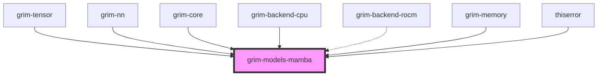

# grim-models-mamba

## Purpose
Provides implementations of the Mamba and SSM (State Space Model) architectures (e.g., Mamba, Mamba2, RWKV) for Grim, implementing the `StatefulSequence` trait.

## Boundaries
- Implements selective state-space scan and hybrid SSM+attention architectures.
- Relies on custom or CPU fallback selective scan kernels.
- Does not implement standard KV caching (maintains its own continuous state `SsmState`).

## Dependency Graph


## Public API Overview
- **Model Structs:** `Mamba`, `MambaBlock`, `Rwkv`.
- **State Handling:** `MambaState`.
- **Configurations:** `MambaConfig`, `RwkvConfig`.

## Usage Example
```rust
use grim_models_mamba::{Mamba, MambaConfig};
use grim_tensor::Device;

// let mamba = Mamba::random(Device::Cpu, mamba_config);
```

## Use Cases
- Sequence generation with constant-memory bounds via continuous state spaces rather than exact attention.
- Running RWKV or Mamba based models natively within the Grim ecosystem.

## Edge Cases, Limitations, and Quirks
- Tensor parallel loading is restricted for Mamba since the SSM recurrent path has no row-parallel all-reduce semantics; `load_tp` currently returns unimplemented for `world_size > 1`.
- The `b_param` must never be aliased to `a_log` during execution.

## Build Flags, Feature Flags, and Environment Variables
- `default`: No special features.
- `rocm`: Enables `grim-backend-rocm` for GPU-accelerated selective scan kernels.
