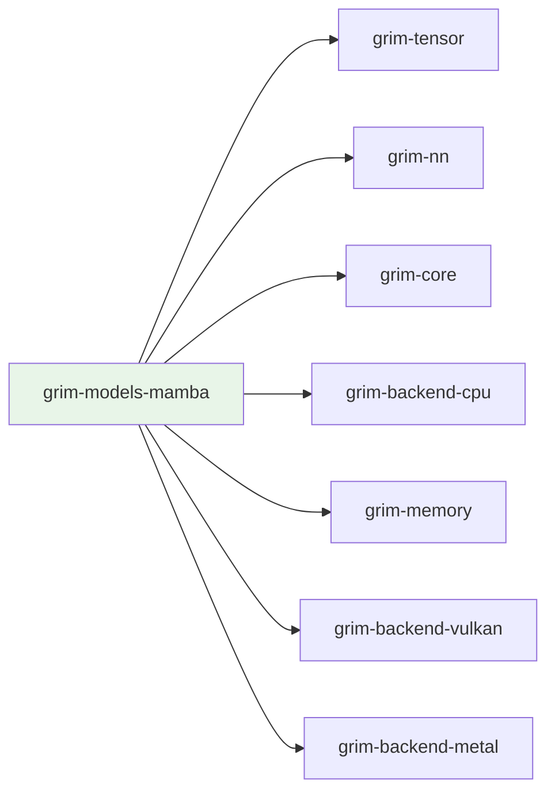

# grim-models-mamba

Mamba/SSM model family for Grim — selective state-space scan with optional hybrid SSM+attention layers.

## Purpose

Provides the `Mamba` model struct and `MambaConfig` for Mamba-style selective state-space models. Implements the `StatefulSequence` trait from `grim-core`. Optionally composes attention blocks alongside SSM blocks for hybrid architectures.

## Boundaries

- Does **not** handle HTTP serving — see `grim-server`.
- Does **not** implement the KV cache — uses SSM state instead (managed via `grim-memory`).
- Does **not** perform quantization — uses `grim-quant` for dequantized weight access.

## Dependency Graph



## Public API

```rust
pub use mamba::{Mamba, MambaConfig, MambaBlock};

pub struct MambaConfig {
    pub vocab_size: usize,
    pub hidden_size: usize,
    pub d_state: usize,
    pub d_inner: usize,
    pub d_conv: usize,
    pub num_layers: usize,
    pub conv_kernel: usize,
    pub rms_norm_eps: f32,
}

pub struct Mamba {
    pub cfg: MambaConfig,
    pub device: grim_tensor::Device,
}

impl Mamba {
    pub fn new(config: MambaConfig) -> Self;
}
```

## Feature Flags

| Flag | Default | Description |
|---|---|---|
| `rocm` | no | Enable ROCm backend for Mamba kernels |

## Usage Example

```rust
use grim_models_mamba::{Mamba, MambaConfig};
use grim_tensor::Device;

let config = MambaConfig {
    vocab_size: 50257,
    hidden_size: 2048,
    d_state: 128,
    d_inner: 5120,
    d_conv: 4,
    num_layers: 24,
    conv_kernel: 4,
    rms_norm_eps: 1e-5,
};
let model = Mamba::new(config);
```

## Edge Cases, Limitations, and Quirks

- The ROCm feature enables GPU-accelerated selective scan kernels; without it, Mamba falls back to CPU execution.
- SSM state is managed through `grim-memory`'s pooled allocation — callers should not assume state is zero-initialized between requests.
