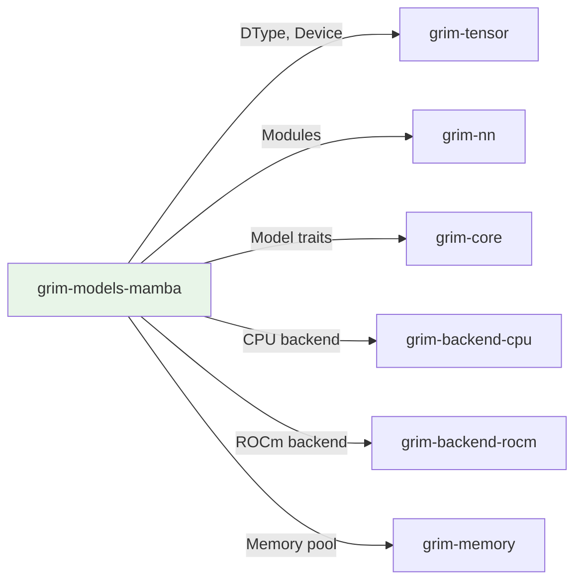

# grim-models-mamba

Mamba/SSM model family for Grim — selective state-space scan + hybrid SSM+attention. Implements StatefulSequence.

## Purpose

Implements Mamba architecture for sequence modeling:
- Selective State Space Model (SSM) for linear-time sequence processing
- Hybrid SSM + attention for long-context efficiency
- Hardware-efficient recurrent scanning

## Boundaries

- Does not perform tensor operations — delegates to backends
- Does not manage KV cache — uses SSM state pool instead
- Does not handle model loading — see `grim-format`

## Dependency Graph



## Public API

### MambaModel

```rust
pub struct MambaModel {
    pub embeddings: Embedding,
    pub layers: Vec<MambaBlock>,
    pub norm: RmsNorm,
    pub lm_head: Linear,
}

impl CausalLm for MambaModel { /* ... */ }

pub struct MambaBlock {
    pub norm: RmsNorm,
    pub mamba: MambaCell,
    pub attn: Option<Attention>,
}
```

## Usage Example

```rust
use grim_models_mamba::MambaModel;

let model = MambaModel::new(
    vocab_size: 50257,
    hidden_dim: 2048,
    num_layers: 24,
    ssm_state: 128,
);
```

## Feature Flags

| Flag | Default | Description |
|---|---|---|
| rocm | - | Enable ROCm backend for Mamba kernels |

## Edge Cases

1. **Selective scan**: Requires HIP kernel on ROCm for efficiency
2. **SSM state**: Managed via `grim-memory::SsmStatePool`
3. **Hybrid attention**: Optional attention head for short-range context