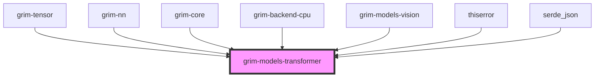

# grim-models-transformer

## Purpose
Implements Llama, Mistral, and other dense and MoE transformer models for Grim. It fulfills the `CausalLm` trait defined in `grim-core`.

## Boundaries
- Contains architectural definitions, configuration definitions, and forward passes for transformers.
- Employs layers from `grim-nn` and tensor ops from `grim-tensor`.
- Does not perform sequence sampling or KV cache management internally (delegated to `grim-core`).

## Dependency Graph


## Public API Overview
- **Model Structs:** `Llama`, `Mistral3`, `Mistral4`, `Gemma`, `Qwen`, `Phi2`, `DeepSeek`, `Cohere2`, `Falcon`, etc.
- **Configurations:** `LlamaConfig`, `Mistral3Config`, `GemmaConfig`, `QwenConfig`, `PhiConfig`, etc.
- **Components:** `LlamaBlock`, `LlamaLayerCache`.

## Usage Example
```rust
use grim_models_transformer::{Llama, LlamaConfig};
use grim_tensor::Device;

// Initialization
// let model = Llama::random(Device::Cpu, config);
```

## Use Cases
- Running inference on transformer-based text generation models (e.g., Llama 2/3, Mistral, Qwen).
- Extracting specific hidden states or manipulating transformer block components.

## Edge Cases, Limitations, and Quirks
- Extensive variety of models requires exact parameter naming matches when loading weights via `grim-nn::WeightSource`.
- Includes MoE (Mixture of Experts) variants which impose different memory layouts.

## Build Flags, Feature Flags, and Environment Variables
- No specific crate features defined beyond `default = []`.
