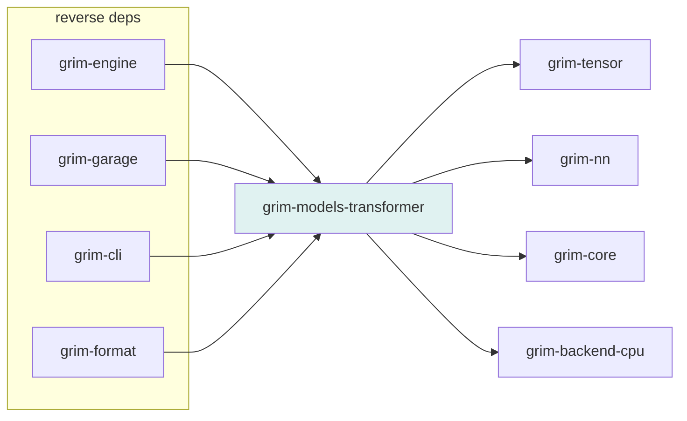

# grim-models-transformer

Llama/Mistral-style dense transformer — the first `CausalLm` implementation in Grim.

## Purpose

Provides the `Llama` model struct and `LlamaConfig`, transformer blocks (`LlamaBlock`), config helpers (`BloomConfig`, `FalconConfig`, `MoeConfig`, `PhiConfig`, `QwenConfig`), LoRA adapter support, and native multi-token prediction (`LlamaMtp`). Implements `grim_core::CausalLm`.

## Boundaries

- Does **not** handle HTTP serving — see `grim-server`.
- Does **not** manage the KV cache mechanism — delegates to `grim-memory::PagedKvCache` via the `KvCache` trait in `grim-core`.
- Does **not** perform weight quantization/dequantization — uses `grim-nn` modules and `grim-quant` for quantized weight access.

## Dependency Graph



## Public API

```rust
pub use model::{Llama, LlamaConfig};

pub struct LlamaConfig {
    pub vocab_size: usize,
    pub hidden_size: usize,
    pub num_heads: usize,
    pub num_kv_heads: usize,
    pub head_dim: usize,
    pub num_layers: usize,
    pub intermediate_size: usize,
    pub rms_norm_eps: f32,
    pub rope_theta: f32,
    pub max_seq_len: usize,
}

pub struct Llama {
    pub cfg: LlamaConfig,
    pub device: grim_tensor::Device,
}

impl Llama {
    pub fn new(config: LlamaConfig) -> Self;
    pub fn random(device: grim_tensor::Device, config: LlamaConfig) -> Self;
}

impl CausalLm for Llama {
    fn load(&mut self, src: &mut impl TensorProvider,
            progress: Option<&dyn Fn(f32)>) -> Result<()>;
    fn forward(&mut self, positions: &[u32], input_ids: &[u32],
               past: Option<&dyn KvCache>, adapters: &[AdapterHandle])
        -> Result<grim_core::Logits>;
}
```

```rust
pub use block::{LlamaBlock, LlamaConfigRefs};
pub use configs::{BloomConfig, FalconConfig, MoeConfig, PhiConfig, QwenConfig};
pub use native_mtp::{LlamaMtp, MtpDepthProvider};
pub mod lora;
```

## Usage Example

```rust
use grim_models_transformer::{Llama, LlamaConfig};
use grim_tensor::Device;

let config = LlamaConfig {
    vocab_size: 32000,
    hidden_size: 512,
    num_heads: 8,
    num_kv_heads: 2,
    head_dim: 64,
    num_layers: 4,
    intermediate_size: 1024,
    rms_norm_eps: 1e-5,
    rope_theta: 10000.0,
    max_seq_len: 2048,
};
let model = Llama::random(Device::Cpu, config);
```

## Edge Cases, Limitations, and Quirks

- `Llama::random` is a test fixture that creates a model with random weights — not suitable for real inference.
- LoRA adapters are loaded via the `lora` module and applied during `forward` — see `grim-engine`'s adapter registry for integration.
- Native MTP (`LlamaMtp`) implements `NativeMtp` from `grim-speculative` — enables multi-token prediction without a separate draft model.
