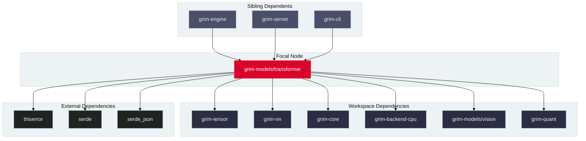

# grim-models-transformer

## Purpose

`grim-models-transformer` provides autoregressive causal language model implementations for dense and mixture-of-experts transformer architectures, including LLaMA, Mistral, Gemma, DeepSeek, and Qwen (including Qwen3.8-Flash-Next with Gated DeltaNet linear attention, 4-branch gated residual streams, PLE N-gram embedding projections, and 512 routed experts).

## Boundaries

`grim-models-transformer` does **not**:
- Allocate physical KV cache pages or maintain prefix hash trees (delegated to `grim-memory`).
- Parse raw file byte containers directly (delegated to `grim-format`).
- Perform token sampling or continuous batch scheduling (delegated to `grim-core` and `grim-scheduler`).

## Dependency Graph



## Public API Overview

Exposed from `src/lib.rs`:

```rust
/// Qwen3.8-Flash-Next architecture with GDN, Gated Residual streams, and PLE embeddings.
pub struct Qwen38FlashNext {
    // ...
}

/// Configuration matching HuggingFace/vLLM qwen4_exp_text checkpoints.
pub struct Qwen38FlashNextConfig {
    pub vocab_size: usize,
    pub hidden_size: usize,
    pub num_heads: usize,
    pub num_kv_heads: usize,
    pub head_dim: usize,
    pub num_layers: usize,
    pub intermediate_size: usize,
    pub num_experts: usize,
    pub num_experts_per_tok: usize,
    pub ngram_vocab_size: Option<usize>,
    pub ngram_dim: Option<usize>,
    pub split_ngram_parts: usize,
    pub ngram_size: usize,
    // ...
}

impl Qwen38FlashNext {
    pub fn load(device: Device, ws: &WeightSource<'_>, cfg: Qwen38FlashNextConfig) -> Result<Self, Error>;
    pub fn load_tp(device: Device, ws: &WeightSource<'_>, cfg: Qwen38FlashNextConfig, tp: &TensorParallelConfig) -> Result<Self, Error>;
}

/// Canonical CausalLm interface implementation for autoregressive token prediction.
impl CausalLm for Qwen38FlashNext {
    fn forward(&self, session: &mut dyn SessionT, input_ids: &Tensor, positions: &Tensor, mask: &[u8]) -> Result<Tensor, Error>;
}
```

## Usage Example

```rust
use grim_models_transformer::qwen38_flash_next::{Qwen38FlashNext, Qwen38FlashNextConfig};
use grim_tensor::Device;

fn main() -> Result<(), Box<dyn std::error::Error>> {
    let mut cfg = Qwen38FlashNextConfig::default();
    cfg.vocab_size = 152064;
    cfg.hidden_size = 2560;

    let model = Qwen38FlashNext::random(Device::Cpu, cfg);
    println!("Instantiated Qwen3.8-Flash-Next causal LM model");
    Ok(())
}
```

## Use Cases

- Running high-throughput autoregressive inference across standard dense architectures (LLaMA 3, Mistral, Gemma).
- Serving frontier architectures like Qwen3.8-Flash-Next with hybrid linear attention and auxiliary PLE position-aware N-gram embeddings.
- Loading sharded SafeTensors parameters with tensor parallelism.

## Edge Cases, Limitations, and Quirks

1. **PLE Weight Availability**: `Qwen38FlashNext::load` requires both `ngram_embedding` table shards and `key_proj` projections when `ngram_vocab_size` is specified; missing keys fail loudly with `Error::Config`.
2. **Residual Stream Dimensionality**: The 4-branch gated residual mixer operates on `4 * hidden_size` activation vectors scaled by $1 / \sqrt{4} = 0.5$.

## Build Flags, Feature Flags, and Environment Variables

- `default`: No special features.
