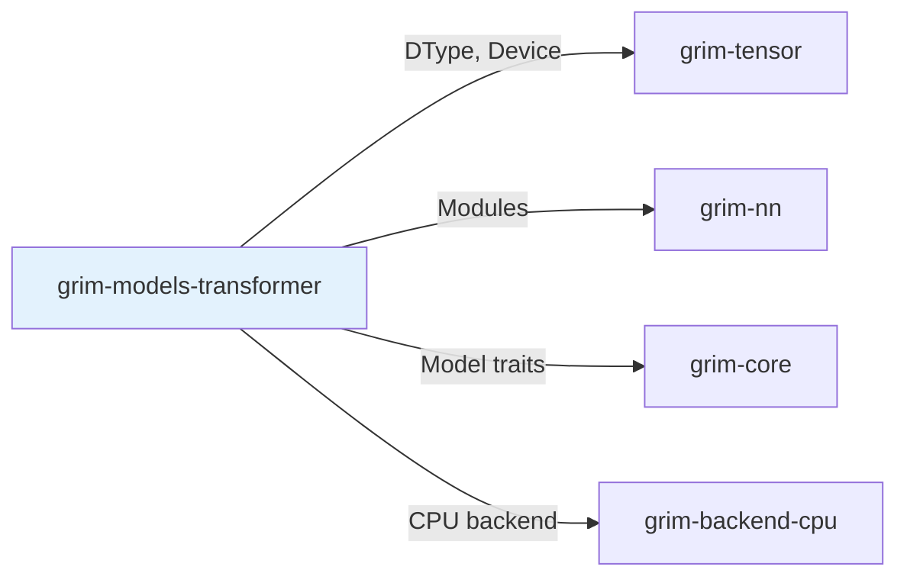

# grim-models-transformer

Llama/Mistral-style dense transformer model for Grim — first CausalLm implementation.

## Purpose

Implements causal language modeling for decoder-only transformers:
- Llama-style attention with RoPE
- Mistral-style sliding window attention
- Group-query attention (GQA) support

This is the first and primary `CausalLm` implementation in Grim.

## Boundaries

- Does not perform tensor operations — delegates to backends
- Does not manage KV cache — that's `grim-core::KvCache`
- Does not handle model loading — see `grim-format`

## Dependency Graph



## Public API

### TransformerCausalLm

```rust
pub struct TransformerCausalLm {
    pub embeddings: Embedding,
    pub layers: Vec<TransformerBlock>,
    pub rms_norm: RmsNorm,
    pub lm_head: Linear,
}

impl CausalLm for TransformerCausalLm {
    fn forward(&mut self, positions: &[u32], input_ids: &[u32],
               past: Option<&dyn KvCache>, adapters: &[AdapterHandle]) -> Result<Logits>;
    fn load(&mut self, src: &mut impl TensorProvider,
            progress: Option<&dyn Fn(f32)>) -> Result<()>;
}
```

### TransformerBlock

```rust
pub struct TransformerBlock {
    pub norm_1: RmsNorm,
    pub attn: CausalAttention,
    pub norm_2: RmsNorm,
    pub mlp: MLP,
}
```

## Usage Example

```rust
use grim_models_transformer::TransformerCausalLm;

let mut model = TransformerCausalLm::new(
    vocab_size: 32000,
    hidden_dim: 4096,
    num_layers: 32,
    num_heads: 32,
);

model.load(&mut gguf_provider, None)?;
```

## Feature Flags

This crate has no feature flags.

## Edge Cases

1. **Attention kernels**: GQA and FlashAttention via backend implementations
2. **RoPE scaling**: Position interpolation supported for long contexts
3. **Adapter injection**: LoRA adapters applied in attention and MLP