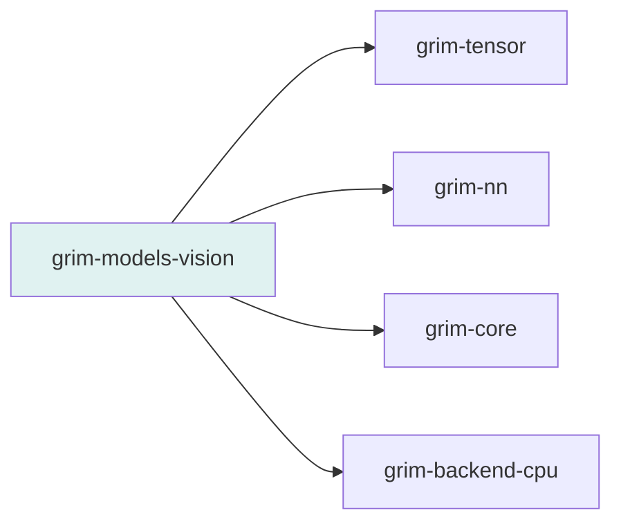

# grim-models-vision

Vision encoders for Grim — ViT/CLIP-style patch embedding + transformer encoder, plus BERT-style text encoders. Implements `Encoder` and `CausalLm` traits from `grim-core`.

## Purpose

Provides vision model implementations: `Vit` (Vision Transformer) for image-to-embedding encoding, and `Bert` for text encoding. Also provides config types for ModernBERT, NomicBert, and T5Encoder.

## Boundaries

- Does **not** handle image file I/O — callers provide `Tensor` inputs.
- Does **not** perform image generation — only feature extraction / encoding.
- Does **not** manage KV cache — vision encoders are single-pass.

## Dependency Graph



## Public API

```rust
pub use vit::{Vit, VitConfig, VitBlock};
pub use bert::{Bert, BertConfig};
pub use configs::{ModernBertConfig, NomicBertConfig, T5EncoderConfig};

pub struct VitConfig {
    pub image_size: usize,
    pub patch_size: usize,
    pub in_channels: usize,
    pub hidden_size: usize,
    pub num_heads: usize,
    pub num_layers: usize,
    pub intermediate_size: usize,
    pub rms_norm_eps: f32,
}

pub struct Vit {
    pub cfg: VitConfig,
    pub device: grim_tensor::Device,
    pub patch_proj_w: Vec<f32>,
    pub patch_proj_b: Vec<f32>,
    pub cls_token: Vec<f32>,
    pub pos_embed: Vec<f32>,
    blocks: Vec<VitBlock>,
    pub ln: grim_nn::RmsNorm,
    pub features: usize,
}

impl Vit {
    pub fn random(device: grim_tensor::Device, cfg: VitConfig) -> Self;
    pub fn new(device: grim_tensor::Device, cfg: VitConfig,
               rng: &mut grim_core::rng::SimpleRng) -> Self;
}

impl grim_core::Encoder for Vit {
    fn encode(&self, input: &grim_tensor::Tensor) -> grim_core::error::Result<grim_tensor::Tensor>;
}
```

## Feature Flags

This crate has no feature flags.

## Edge Cases, Limitations, and Quirks

- `Vit::random` creates a randomly-initialized model suitable for unit tests — not for real inference.
- `blocks` field on `Vit` is private; access is only through `encode`.
