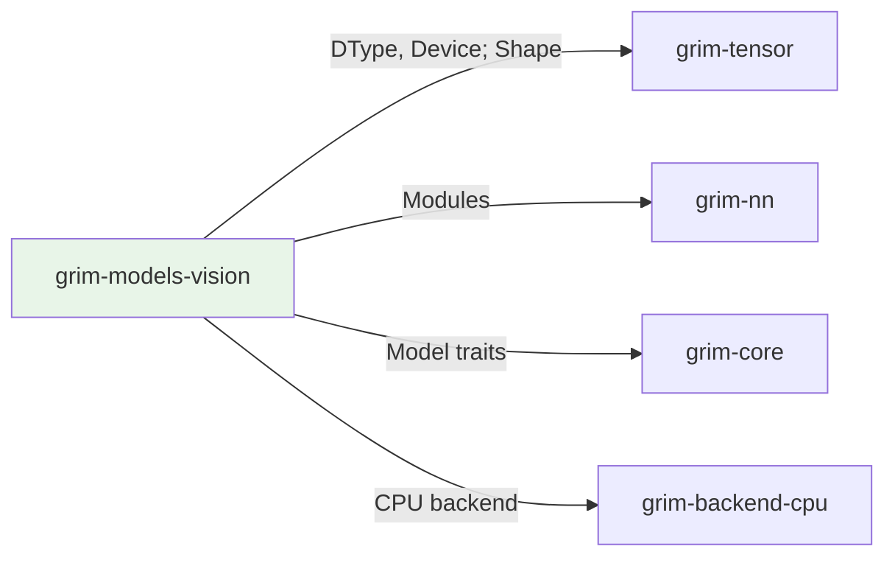

# grim-models-vision

Vision encoder for Grim — ViT/CLIP-style patch embedding + transformer encoder. Implements the Encoder trait.

## Purpose

Implements vision encoder architectures:
- Vision Transformer (ViT) patch embedding
- CLIP-style contrastive learning models
- Image classification and feature extraction

## Boundaries

- Does not perform vision tasks — only extracts embeddings
- Does not manage KV cache — vision encoders are single-pass
- Does not handle model loading — see `grim-format`

## Dependency Graph



## Public API

### VisionEncoder

```rust
pub struct VisionEncoder {
    pub patch_embed: PatchEmbedding,
    pub cls_token: Tensor,
    pub pos_embed: Tensor,
    pub blocks: Vec<ViTBlock>,
    pub norm: RmsNorm,
}

impl Encoder for VisionEncoder {
    fn encode(&mut self, input_ids: &[u32], positions: &[u32]) -> Result<Tensor>;
}
```

### VisionFeatures

```rust
pub struct VisionFeatures {
    pub cls_token: Tensor,
    pub patch_tokens: Tensor,
    pub global_features: Tensor,
}
```

## Usage Example

```rust
use grim_models_vision::VisionEncoder;

let model = VisionEncoder::new(
    image_size: 224,
    patch_size: 16,
    num_layers: 12,
    hidden_dim: 768,
);

let features = model.encode(&token_ids, &positions)?;
```

## Feature Flags

This crate has no feature flags.

## Edge Cases

1. **Patch embedding**: Input flattened to patch tokens
2. **CLS token**: Pooled representation for classification
3. **No KV cache**: Vision is single-pass, no autoregressive generation