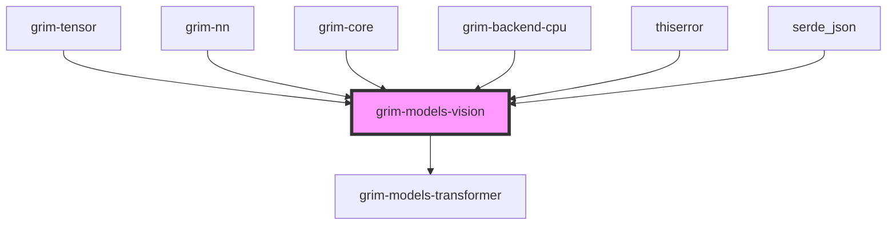

# grim-models-vision

## Purpose
Provides vision encoder implementations (e.g., ViT, CLIP patch embedding, and BERT-style models) for the Grim ecosystem. It implements the `Encoder` trait.

## Boundaries
- Converts images into sequence embeddings (patch embeddings).
- Handles purely encoder transformer blocks.
- Does not contain decoder heads or language model generation capabilities.
- Serves as a dependency for multimodal transformers in `grim-models-transformer`.

## Dependency Graph


## Public API Overview
- **Model Structs:** `Vit`, `Bert`, `GlimmerVision`.
- **Configurations:** `VitConfig`, `BertConfig`, `GlimmerVisionConfig`.

## Usage Example
```rust
use grim_models_vision::{Vit, VitConfig};
// Encode images into embeddings for downstream multimodal components.
```

## Use Cases
- Pre-processing and encoding visual tokens for consumption by large multimodal models (e.g., Llama 3 Vision variants).
- Running standalone Vision Transformers for image representation.

## Edge Cases, Limitations, and Quirks
- The inputs must be correctly normalized and resized prior to being passed into the Vision encoder.

## Build Flags, Feature Flags, and Environment Variables
- No specific crate features defined beyond `default = []`.
