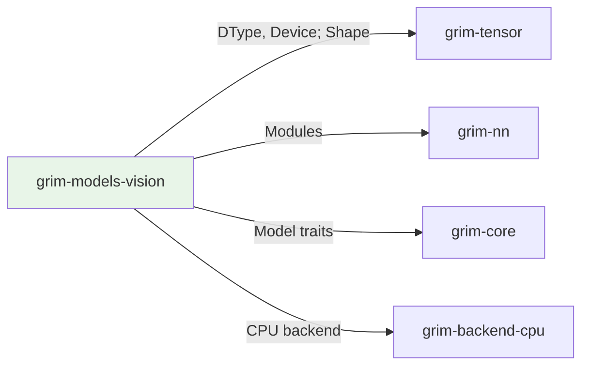

# grim-models-vision

Vision encoder for Grim — ViT/CLIP-style patch embedding + transformer encoder. Implements the Encoder trait.

## Purpose

Implements vision encoder architectures:
- Vision Transformer (ViT) patch embedding
- CLIP-style contrastive learning models
- Image classification and feature extraction

## Boundaries

- Does not perform vision tasks — only extracts embeddings
- Does not manage KV cache — vision encoders are single-pass
- Does not handle model loading — see `grim-format`

## Dependency Graph



## Public API

### Vit

```rust
pub struct Vit {
    pub cfg: VitConfig,
    pub device: Device,
    pub patch_proj_w: Vec<f32>,
    pub patch_proj_b: Vec<f32>,
    pub cls_token: Vec<f32>,
    pub pos_embed: Vec<f32>,
    blocks: Vec<VitBlock>,
    pub ln: RmsNorm,
    pub features: usize,
}

impl Encoder for Vit {
    fn encode(&self, input: &Tensor) -> Result<Tensor>;
}
```

### Bert

BERT-style bidirectional encoder with multi-head self-attention.

```rust
pub struct Bert {
    pub cfg: BertConfig,
    pub device: Device,
    pub word_embeddings: Embedding,
    pub position_embeddings: Embedding,
    pub token_type_embeddings: Embedding,
    pub embeddings_ln: RmsNorm,
    pub layers: Vec<BertBlock>,
}

impl Encoder for Bert {
    fn encode(&self, input: &Tensor) -> Result<Tensor>;
}

impl CausalLm for Bert {
    fn forward(&self, session: &mut dyn SessionT,
               input_ids: &Tensor, positions: &Tensor,
               adapters: &[AdapterHandle]) -> Result<Tensor>;
}
```

## Usage Example

```rust
use grim_models_vision::{Vit, VitConfig, Bert, BertConfig};
use grim_tensor::{Device, Tensor, Shape};

// ViT — random init for testing
let vit_cfg = VitConfig {
    image_size: 224, patch_size: 16, in_channels: 3,
    hidden_size: 768, num_heads: 12, num_layers: 12,
    intermediate_size: 3072, rms_norm_eps: 1e-6,
};
let vit = Vit::random(Device::Cpu, vit_cfg);

// BERT — loaded from weights
let bert_cfg = BertConfig {
    vocab_size: 30522, hidden_size: 768, num_heads: 12,
    num_layers: 12, intermediate_size: 3072, max_seq_len: 512,
};
let bert = Bert::load(Device::Cpu, &ws, bert_cfg)?;
```

## Feature Flags

This crate has no feature flags.

## Edge Cases

1. **Patch embedding**: Input flattened to patch tokens
2. **CLS token**: Pooled representation for classification
3. **No KV cache**: Vision is single-pass, no autoregressive generation