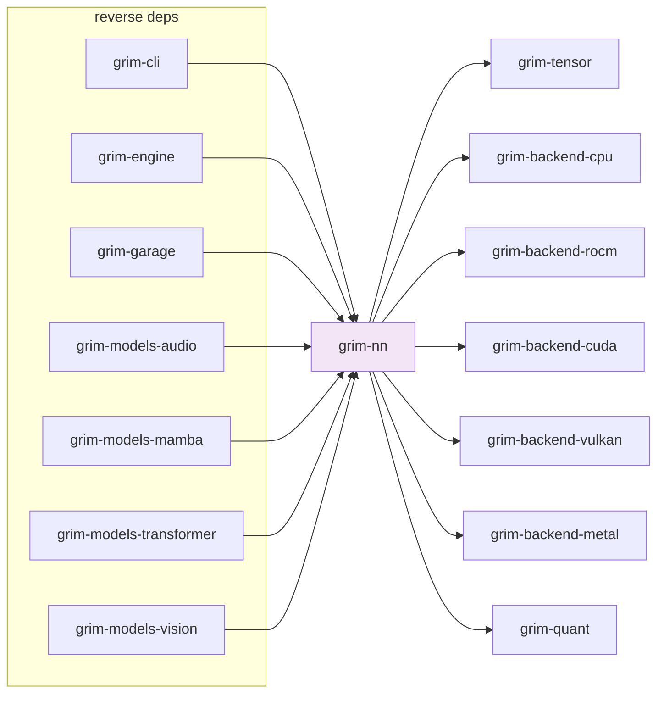

# grim-nn

Neural-network module library: `Linear`, `Embedding`, `RmsNorm`, `RoPE`, tensor-parallel layer variants, and `WeightSource` for loading model weights from checkpoints.

## Purpose

Provides building blocks (NN modules and weight loaders) used by the `grim-models-*` crates to assemble concrete model architectures. The modules abstract over backend dispatch via `grim-tensor`'s `BackendDevice` trait; weight loading is mediated through `WeightSource`, which resolves named tensors from a `TensorProvider` (e.g. a loaded `.grim` or GGUF file) into typed `Tensor` instances.

## Boundaries

- Does **not** define specific model architectures — see `grim-models-transformer`, `grim-models-mamba`, etc.
- Does **not** perform inference scheduling or tokenization — see `grim-engine`, `grim-server`.
- Does **not** manage the KV cache — see `grim-memory` (via `grim-core`'s `KvCache` trait).

## Dependency Graph



## Public API

### Modules

```rust
pub use modules::{
    ColumnParallelLinear, Embedding, Linear, RmsNorm, Rope, RowParallelLinear,
    TensorParallelConfig, add_tensors, pick_device_for_storage_device,
    pick_device_for_tensor,
};
```

`Linear` and `RmsNorm` are standard transformer blocks. `ColumnParallelLinear` / `RowParallelLinear` support tensor-parallel execution across multiple GPUs (§4.6).

### Scythe2 (Capacity-Calibrated Sharded Linears)

```rust
pub use scythe2::{Scythe2Linear, slice_input_dim, slice_output_dim};
```

SCYTHE-2: capacity-calibrated sharded linears for speculative decoding (§5.3).

### WeightSource

```rust
pub struct WeightSource { /* fields */ }

impl WeightSource {
    pub fn tensor(&mut self, name: &str, shape: &[usize]) -> Result<()>;
    pub fn load(&mut self, src: &mut impl TensorProvider) -> Result<()>;
    // get / get_with_shape for typed tensor access
}
```

Source: `src/varbuilder.rs`. Resolves named tensors from a `TensorProvider` implementation.

### Feature Flags

| Flag | Default | Description |
|---|---|---|
| `cuda-mem` | no | Enable CUDA memory allocation paths |
| `rocm-mem` | yes | Enable ROCm memory allocation paths |
| `metal-mem` | yes | Enable Metal memory allocation paths |
| `vulkan-mem` | yes | Enable Vulkan memory allocation paths |

All four are default-on, matching the engine's "all backends available unless explicitly disabled" convention.

## Usage Example

```rust
use grim_nn::{WeightSource, Linear, RmsNorm, TensorParallelConfig};

let mut vs = WeightSource::new();
vs.tensor("embed.weight", &[vocab_size, hidden_dim])?;

let embed_weight = vs.get("embed.weight")?;
let embed = Embedding::new(embed_weight, &device);

let rms = RmsNorm::new(vs.get("rms_norm.weight")?, 1e-5);
```

## Edge Cases, Limitations, and Quirks

- Without the `*-mem` feature for a backend, `to_device` and device allocation calls for that backend return `Err`.
- `ColumnParallelLinear` and `RowParallelLinear` require RCCL/NCCL handles to be set up by the caller (see `grim-engine`'s TP rank contexts).
- Quantized weight formats (Q4_K, etc.) are transparently dequantized on access via `grim-quant` — the dequant kernel is dispatched through the active `BackendDevice`.
