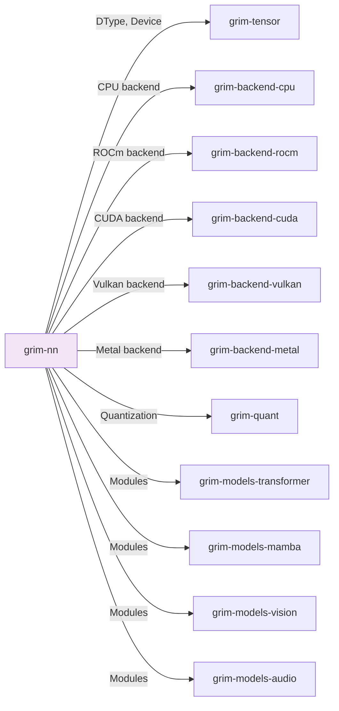

# grim-nn

Neural-network modules and weight-loading for Grim — VarBuilder-equivalent, Linear, RmsNorm, RoPE, Embedding.

## Purpose

Provides neural network modules (Linear, RmsNorm, Embedding, RoPE) and a `VarBuilder`-equivalent `WeightSource` for constructing model weights from loaded tensors. Used by model crates to build transformer, mamba, vision, and audio architectures.

## Boundaries

- Does not define model architectures — see `grim-models-*`
- Does not perform inference — only weight construction
- Does not contain the KV cache implementation — see `grim-core::kv_cache`

## Dependency Graph



## Public API

### WeightSource

```rust
pub struct WeightSource { /* private fields */ }

impl WeightSource {
    pub fn new() -> Self;
    pub fn tensor(&mut self, name: &str, shape: &[usize]) -> Result<()>;
    pub fn get(&self, name: &str) -> Result<Tensor>;
    pub fn get_with_shape(&self, name: &str, shape: &[usize]) -> Result<Tensor>;
}
```

VarBuilder-equivalent for constructing weight tensors from loaded checkpoints.

### Linear

```rust
pub struct Linear { pub weight: Tensor, pub bias: Option<Tensor> }

impl Linear {
    pub fn new(weight: Tensor, bias: Option<Tensor>) -> Self;
    pub fn forward(&self, x: &Tensor) -> Result<Tensor>;
}
```

### RmsNorm

```rust
pub struct RmsNorm { pub weight: Tensor, pub eps: f32 }

impl RmsNorm {
    pub fn new(weight: Tensor, eps: f32) -> Self;
    pub fn forward(&self, x: &Tensor) -> Result<Tensor>;
}
```

### Embedding

```rust
pub struct Embedding { pub weight: Tensor }

impl Embedding {
    pub fn forward(&self, indices: &[u32]) -> Result<Tensor>;
}
```

## Usage Example

```rust
use grim_nn::{WeightSource, Linear, RmsNorm};

let mut vs = WeightSource::new();
vs.tensor("embed.weight", &[vocab_size, hidden_dim])?;
let embed_weight = vs.get("embed.weight")?;

let linear = Linear::new(embed_weight, None);
```

## Feature Flags

| Flag | Default | Description |
|---|---|---|
| cuda-mem | - | Enable CUDA memory allocation |
| rocm-mem | - | Enable ROCm memory allocation |
| metal-mem | - | Enable Metal memory allocation |
| vulkan-mem | - | Enable Vulkan memory allocation |
| gpu-selection | - | Enable all GPU backends |

## Edge Cases

1. **Memory features**: `*-mem` features enable memory allocation on specific backends; without them, `to_device` operations fail
2. **Quantization**: Weights may be stored in quantized formats (Q4_K, etc.) and dequantize on access