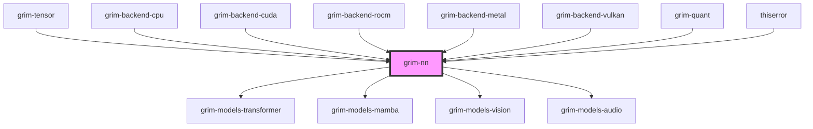

# grim-nn

## Purpose
Provides neural-network modules and weight-loading abstractions for Grim. It contains varbuilder-equivalent functionality, along with standard layers such as `Linear`, `RmsNorm`, `RoPE`, and `Embedding`.

## Boundaries
- Handles weight loading from `WeightSource`.
- Defines parameter-holding network layers.
- Does not contain full model architectures (e.g., Llama, Whisper).
- Relies on `grim-tensor` and backend implementations for execution.

## Dependency Graph


## Public API Overview
- **Modules:** `Linear`, `Embedding`, `RmsNorm`, `Rope`, `ColumnParallelLinear`, `RowParallelLinear`, `Scythe2Linear`.
- **Weight Loading:** `WeightSource`.
- **Specialized Blocks:** `moe` (mixture of experts), `scythe2` (capacity-calibrated sharded linears).

## Usage Example
```rust
use grim_nn::{Linear, RmsNorm, Embedding};
use grim_tensor::Device;

// Example module signatures
// let linear = Linear::load(&weight_source, in_dim, out_dim, false)?;
```

## Use Cases
- Constructing neural network architectures in `grim-models`.
- Sharding parameter weights across tensor parallel configurations.

## Edge Cases, Limitations, and Quirks
- Operations strictly depend on the tensor backend capabilities.
- Not all layers implement automatic sharding fallback.

## Build Flags, Feature Flags, and Environment Variables
- `default`: Enables `cuda-mem`, `rocm-mem`, `metal-mem`, `vulkan-mem`.
- `cuda-mem`, `rocm-mem`, `metal-mem`, `vulkan-mem`: Individual memory backend support.
- `gpu-selection`: Enables all GPU memories.
