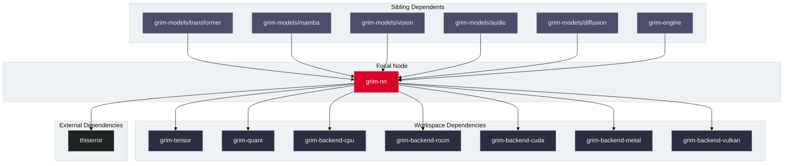

# grim-nn

## Purpose

`grim-nn` provides the neural network layer modules, parameter containers, tensor parallel linear projections, expert bank management, bandwidth-adaptive hybrid MoE partitioning, and structured weight loader abstractions for Grim.

## Boundaries

`grim-nn` does **not**:
- Define end-to-end model architectures like LLaMA, Qwen, or Whisper (delegated to `grim-models/*`).
- Parse binary container files from disk (delegated to `grim-format`).
- Perform low-level hardware kernel dispatch or stream synchronization (delegated to backend crates).

## Dependency Graph



## Public API Overview

Exposed from `src/lib.rs`:

```rust
/// Standard neural network linear layer with optional bias.
pub struct Linear {
    pub weight: Tensor,
    pub bias: Option<Tensor>,
}

/// Root-mean-square layer normalization with learnable scale.
pub struct RmsNorm {
    pub weight: Tensor,
    pub eps: f32,
}

/// Rotary positional embedding (RoPE) operator with theta scaling.
pub struct Rope {
    pub dim: usize,
    pub theta: f32,
}

/// Bandwidth benchmark descriptor for PCIe and CPU host RAM transfer rates.
#[derive(Debug, Clone, Copy)]
pub struct PcieBench {
    pub pcie_bw_gb_s: f64,
    pub cpu_ram_bw_gb_s: f64,
}

/// Hybrid MoE partitioner calculating optimal fetch fraction $q^\star = \text{BW}_{\text{pcie}} / \text{BW}_{\text{cpu\_ram}}$.
pub struct HybridExecutor {
    pub bench: PcieBench,
    pub num_experts: usize,
    pub expert_dim: usize,
}

impl HybridExecutor {
    pub fn new(bench: PcieBench, num_experts: usize, expert_dim: usize) -> Self;
    pub fn optimal_fetch_ratio(&self) -> f64;
    pub fn partition_experts(&self, requested_experts: &[usize]) -> (Vec<usize>, Vec<usize>);
}

/// Structured hierarchical weight extractor for model loading.
pub struct WeightSource<'a> {
    // ...
}
```

## Usage Example

```rust
use grim_nn::moe_hybrid::{HybridExecutor, PcieBench};

fn main() {
    // PCIe Gen4 x16 (24 GB/s) vs DDR5 dual-channel host RAM (64 GB/s)
    let bench = PcieBench::from_values(24.0, 64.0);
    let executor = HybridExecutor::new(bench, 64, 4096);

    let (gpu_fetch, cpu_exec) = executor.partition_experts(&[1, 5, 12, 18, 24, 30, 42, 55]);
    println!("GPU fetch count: {}, CPU compute count: {}", gpu_fetch.len(), cpu_exec.len());
}
```

## Use Cases

- Instantiating canonical transformer and state-space layers across all `grim-models` crates.
- Sharding parameter weights across multi-GPU tensor parallel configurations.
- Partitioning active MoE experts dynamically according to the physical PCIe-to-RAM bandwidth ratio $q^\star$ to hide data transfer latency during high-batch decode.

## Edge Cases, Limitations, and Quirks

1. **Bandwidth Floor**: `PcieBench` enforces a minimum bandwidth floor of `0.1 GB/s` to prevent division-by-zero during ratio calculation.
2. **Device Specialization**: Parallel linear modules (`ColumnParallelLinear`, `RowParallelLinear`) require active collective communicators when `world_size > 1`.

## Build Flags, Feature Flags, and Environment Variables

- `default`: Enables `cuda-mem`, `rocm-mem`, `metal-mem`, `vulkan-mem`.
- `cuda-mem`, `rocm-mem`, `metal-mem`, `vulkan-mem`: Individual backend memory support.
