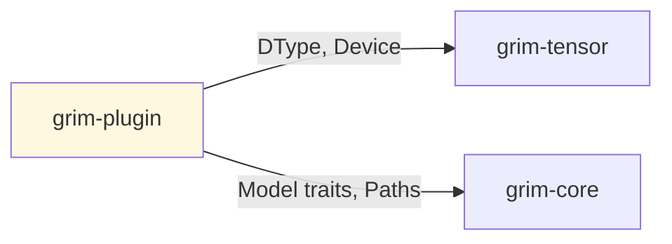

# grim-plugin

Plugin system for Grim — dynamic library + WASM component loading, ABI, capability flags. §6 of Grim architecture.

## Purpose

Provides a pluggable architecture for extending Grim:
- Dynamic library (.so/.dylib/.dll) loading
- WASM component sandboxing for untrusted code
- Capability-based security model

Used for:
- Custom model architectures
- Tokenizer implementations
- Hardware-specific kernels

## Boundaries

- Does not perform inference — only loads extension code
- Does not define the Model trait — see `grim-core`
- Dependencies on backend types are through optional features

## Dependency Graph



## Public API

### PluginManager

```rust
pub struct PluginManager {
    plugins: HashMap<String, LoadedPlugin>,
}

pub enum LoadedPlugin {
    Dylib { lib: Library, abi: PluginAbi },
    Wasm { instance: Instance, abi: PluginAbi },
}

impl PluginManager {
    pub fn new() -> Self;
    pub fn load_dylib(&mut self, path: &Path) -> Result<()>;
    pub fn load_wasm(&mut self, path: &Path) -> Result<()>;
    pub fn get_model(&self, name: &str) -> Option<&dyn CausalLm>;
}
```

### PluginAbi

```rust
pub struct PluginAbi {
    pub name: String,
    pub version: Version,
    pub capabilities: Vec<Capability>,
    pub model_entry_point: dlopen::Symbol<unsafe extern "C" fn() -> *mut c_void>,
}
```

## Usage Example

```rust
use grim_plugin::PluginManager;

let mut manager = PluginManager::new();
manager.load_wasm("my-model-plugin.grimplugin")?;
let model = manager.get_model("my-model");
```

## Feature Flags

| Flag | Default | Description |
|---|---|---|
| wasm-sandbox | - | Enable WASM runtime (requires wasmtime) |
| dylib-loading | - | Enable dynamic library loading (requires libloading) |

## Edge Cases

1. **Capability flags**: Plugins must declare required capabilities
2. **WASM sandboxing**: Enabled by feature flag; isolates untrusted code
3. **ABI stability**: Plugins must match engine's expected ABI version