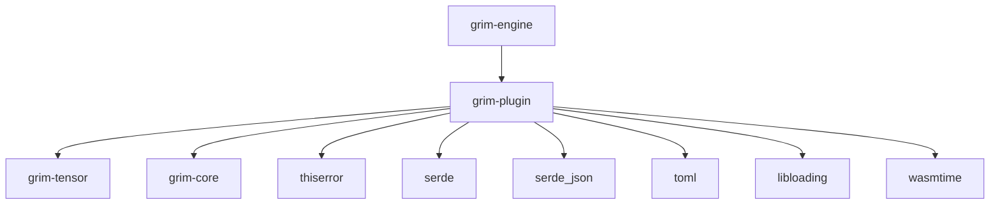

# grim-plugin

## Purpose
Provides a third-party extension system for Grim. It supports high-performance shared-memory dynamic libraries (dylibs) and secure sandboxed WASM components.

## Boundaries
- Focuses strictly on loading, ABI validation, and invocation.
- Does not implement specific logic for models or samplers (plugins do that).
- Relies on `libloading` for dynamic libraries and `wasmtime` for sandboxing.

## Dependency Graph


## Public API Overview
- `PluginRegistry`: Container discovering and storing active plugins.
- `PluginManifest`: Parsed representation of `plugin.grim.toml`.
- `PluginCapabilities`: Bitflags delineating plugin features (Model, Sampler, Backend, etc.).
- `WasmPluginLoader` & `DylibPluginLoader`: Strategy-specific loaders.
- `GrimPluginVTable`: Stable C ABI vtable for Dylib FFI boundaries.

## Usage Example
```rust
use grim_plugin::PluginRegistry;

let mut registry = PluginRegistry::new();
// registry.scan_plugin_directory("/path/to/plugins").unwrap();

// if let Some(sampler) = registry.get_sampler("grammar-constrained-json") {
//     // use sampler
// }
```

## Use Cases
- Distributing proprietary models via compiled Dylibs.
- Sandboxing untrusted community pre/post-processors with WASM limits.
- Injecting constrained grammar samplers without rebuilding the core engine.

## Edge Cases, Limitations, and Quirks
- Dylib plugins execute in process memory; a segmentation fault in a Dylib will crash Grim.
- WASM plugins have fixed memory and execution fuel limits to prevent runaway loops, configured in `plugin.grim.toml`.
- Duplicate stage and priority pairs for processing pipelines are rejected at load time.

## Build Flags, Feature Flags, and Environment Variables
- `default`: Base system only.
- `wasm-sandbox`: Pulls in `wasmtime` for WASM plugin support.
- `dylib-loading`: Pulls in `libloading` for shared library support.
