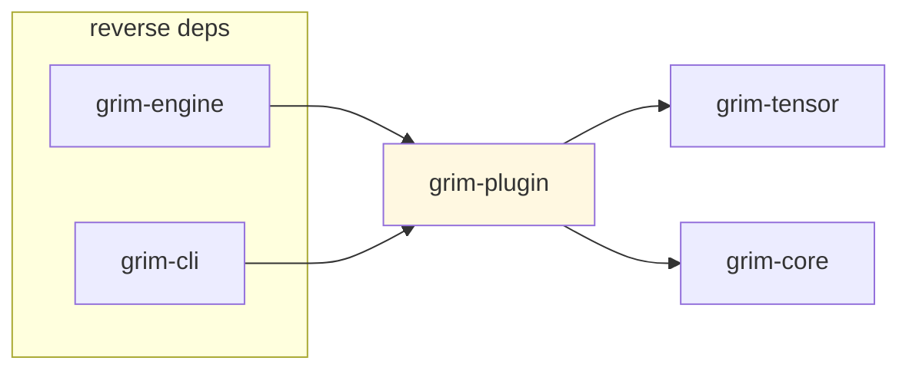

# grim-plugin

Plugin system for Grim — dynamic library and WASM component loading with capability-based security. Architecture §6.

## Purpose

Provides loading infrastructure for third-party extensions: dylib plugins (for performance-critical kernels and model architectures) and WASM sandboxed plugins (for control-path extensions like samplers, tokenizers, pre/post-processors). Defines the `PluginManifest` schema, `PluginCapabilities` bitflags, ABI validation, and the `DylibPluginLoader` / `WasmPluginLoader` implementations.

## Boundaries

- Does **not** perform inference — only loads extension code.
- Does **not** define the `Model` or `Sampler` traits — those are in `grim-core`; it re-exports `Sampler` for plugin integration.
- Does **not** handle HTTP serving — see `grim-server`.

## Dependency Graph



## Public API

```rust
pub use arch_compat::ArchCompatSpec;
pub use dylib_loader::DylibPluginLoader;
pub use wasm_loader::WasmPluginLoader;
pub use grim_core::sampler::Sampler;

pub struct PluginCapabilities(pub u32);
pub struct GrimPluginVTable { /* function pointers */ }
pub enum PluginKind { /* Dylib, Wasm */ }
pub struct PluginGrants { /* granted capabilities */ }
pub struct PluginReload { /* reload policy */ }
pub struct PluginManifest { /* fields */ }
pub struct PluginLimits { /* memory/fuel limits */ }

pub fn parse_manifest(toml_text: &str) -> Result<PluginManifest>;
pub fn validate_abi(manifest: &PluginManifest, engine_abi: u32) -> Result<()>;

pub struct PluginRegistry { /* loaded plugin set */ }
```

## Feature Flags

| Flag | Default | Description |
|---|---|---|
| `dylib-loading` | no | Enable dynamic library loading via `libloading` |
| `wasm-sandbox` | no | Enable WASM runtime via `wasmtime` |

## Usage Example

```rust
use grim_plugin::PluginRegistry;

// grim-cli/src/plugin.rs handles loading:
//   let count = load_plugins("/path/to/plugins", &mut registry)?;
//   let list = list_plugins(&registry);
```

## Edge Cases, Limitations, and Quirks

- Dylib plugins share process memory — a crash in the plugin takes the engine down. Only first-party and reviewed plugins should use this path.
- WASM plugins are sandboxed with fuel and memory limits — they cannot touch host memory outside their grants.
- `validate_abi` checks the plugin's declared ABI version against the engine's compiled `engine_abi` constant — mismatched versions are rejected before loading.
