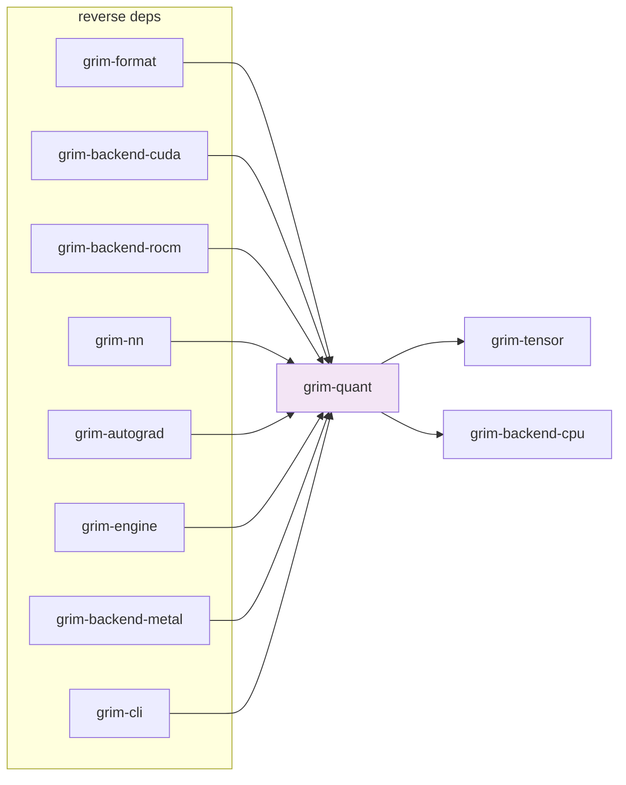

# grim-quant

Quantization format enumeration, tensor rewrite planning, and dequantization routines for all supported weight formats (Q4_K, Q8_0, NF4, FP8, MXFP4/8, GPTQ, SPQR, IQ1–4, SoulEater).

## Purpose

Defines the `QuantFormat` enum, `TensorRewritePlan` and `RewrittenTensorData` types for the conversion pipeline, and a set of `dequant_*` functions that convert block-quantized byte arrays back to `Vec<f32>`. Also provides `SpqrSalientResidual` and `spqr_identify_salient` from the SPQR module, and the `soul_eater` module for training-time quantization.

## Boundaries

- Does **not** implement quantized GEMM kernels — those live in `grim-backend-*` (e.g., `dequant_row`, `gemm_f32_simd`).
- Does **not** read or write model checkpoint files — that is `grim-format`'s role.
- Does **not** provide quantization-aware training (QAT) — see `grim-autograd`.

## Dependency Graph



## Public API

```rust
pub const BLOCK_SIZE_Q8: usize = 32;
pub const BLOCK_SIZE_Q4_K: usize = 32;

pub enum QuantFormat {
    Q8_0, Q4K, Q5K, Q6K, Fp4, Nf4, Fp8,
    Fp4Block16, Fp8Block16,
    Iq4Nl, Iq4Xs, Iq3Xxs, Iq3S,
    Iq2Xxs, Iq2Xs, Iq2S,
}

pub struct TensorRewritePlan {
    pub target: QuantFormat,
    pub shape: Vec<usize>,
    pub importance: Option<Vec<f32>>,
    pub curvature: Option<Vec<f32>>,
}

pub struct RewrittenTensorData {
    pub bytes: Vec<u8>,
    pub logical_shape: Vec<usize>,
    pub target: QuantFormat,
    pub wavefront_tiled: bool,
}

pub fn dequant_gptq_group_int(qweight: &[u8], qzeros: &[u8],
    scales: &[u8], g_idx: Option<&[u8]>, shape: &[usize],
    bits: u32, group_size: usize) -> Result<Vec<f32>>;

pub fn dequant_q80(data: &[u8], num_weights: usize) -> Result<Vec<f32>>;
pub fn dequant_q4k(data: &[u8], num_weights: usize) -> Result<Vec<f32>>;
pub fn dequant_q5k(data: &[u8], num_weights: usize) -> Result<Vec<f32>>;
pub fn dequant_q6k(data: &[u8], num_weights: usize) -> Result<Vec<f32>>;
pub fn dequant_q2k(data: &[u8], num_weights: usize) -> Result<Vec<f32>>;
pub fn dequant_q3k(data: &[u8], num_weights: usize) -> Result<Vec<f32>>;
pub fn dequant_iq4nl(data: &[u8], num_weights: usize) -> Result<Vec<f32>>;
pub fn dequant_iq4xs(data: &[u8], num_weights: usize) -> Result<Vec<f32>>;
pub fn dequant_iq3xxs(data: &[u8], num_weights: usize) -> Result<Vec<f32>>;
pub fn dequant_iq3s(data: &[u8], num_weights: usize) -> Result<Vec<f32>>;
pub fn dequant_iq2xxs(data: &[u8], num_weights: usize) -> Result<Vec<f32>>;
pub fn dequant_iq2xs(data: &[u8], num_weights: usize) -> Result<Vec<f32>>;
pub fn dequant_iq2s(data: &[u8], num_weights: usize) -> Result<Vec<f32>>;
pub fn dequant_fp4(data: &[u8], num_values: usize) -> Result<Vec<f32>>;
pub fn dequant_fp8(data: &[u8], num_values: usize) -> Result<Vec<f32>>;
pub fn dequant_fp4_block16(data: &[u8], num_values: usize) -> Result<Vec<f32>>;
pub fn dequant_fp8_block16(data: &[u8], num_values: usize) -> Result<Vec<f32>>;
pub fn dequant_mxfp4(data: &[u8], num_values: usize) -> Result<Vec<f32>>;
pub fn dequant_mxfp8(data: &[u8], num_values: usize) -> Result<Vec<f32>>;

pub mod soul_eater;
pub mod spqr;
pub use spqr::{SpqrSalientResidual, spqr_identify_salient};
```

## Usage Example

```rust
use grim_quant::{dequant_q4k, QuantFormat, TensorRewritePlan};

let f32_weights = dequant_q4k(&bytes, 1024)?;
```

## Feature Flags

This crate has no feature flags.

## Edge Cases, Limitations, and Quirks

- `BLOCK_SIZE_Q8` and `BLOCK_SIZE_Q4_K` are both 32 — block quant formats use fixed 32-element blocks regardless of bit width.
- `dequant_gptq_group_int` supports 2/3/4/8-bit packing with GPTQ/BitBLAS cross-word layout.
- `RewrittenTensorData::wavefront_tiled` is a flag for callers (`grim-format`) to set `GrimLayoutHint::WavefrontTiled` — it indicates the writer should store the tensor in wavefront-tiled layout for ROCm LDS efficiency.
