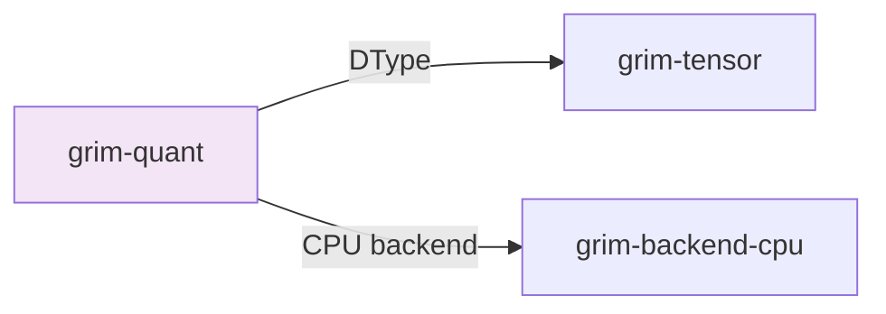

# grim-quant

Block quantizers (Q8_0, Q4_K, Q5_K, Q6_K) for Grim. Dequant-to-f32 on load, per-block scale/min following llama.cpp design.

## Purpose

Provides quantization schemes and calibration utilities for converting full-precision weights to block-quantized formats. Used by `grim-format` for GGUF loading and `grim-nn` for weight application.

## Boundaries

- Does not provide dequantization kernels (see backend-specific implementations)
- Does not handle training — only post-training quantization
- Does not provide QAT (Quantization-Aware Training) — that's in `grim-autograd`

## Dependency Graph



## Public API

### KQuantScheme

```rust
pub enum KQuantScheme {
    Q2K, Q3K, Q4K, Q5K, Q6K, Q80,
    IQ4NL, IQ4XS, IQ3XXS, IQ3S,
    IQ2XXS, IQ2XS, IQ2S,
}
```

Quantization schemes compatible with llama.cpp K-quant formats.

### DType Storage Variants

```rust
pub enum Storage {
    Native,
    KQuant(KQuantScheme),
    GroupInt(GpuIntConfig),
    FloatPack(FloatPackScheme),
    Block(BlockDtype),
}
```

### Calibration Types

`grim-quant` provides Fisher/GGN diagonal calibration utilities for importance-based quantization.

## Usage Example

```rust
use grim_quant::quantize_weights;
use grim_tensor::{DType, Storage, KQuantScheme};

// Convert quantized tensor to storage
let quantized = quantize_weights(&tensor, KQuantScheme::Q4K);
```

## Feature Flags

| Flag | Description |
|---|---|
| (none) | Default features are empty |

## Edge Cases

1. **Q4_K**: Most compact format; 4 bits per weight with 16-byte blocks
2. **IQ variants**: Importance-matrix-optimized quantization from EfficientQAT pipelines
3. **Dequantization**: Must happen on load via `from_cpu_bytes` in the backend