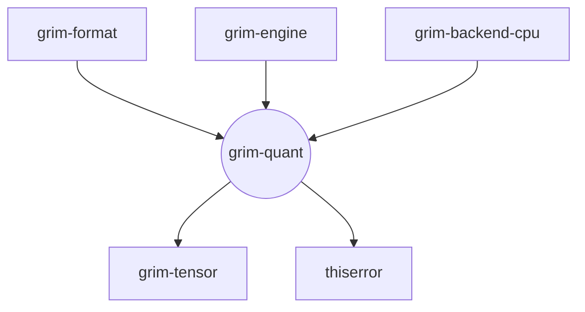

# grim-quant

## Purpose
The `grim-quant` crate implements block quantization schemas, dequantization reference routines, and quantization rewriting plans. It serves as the authoritative definition for weight quantization formats (like Q8_0, Q4_K, Q5_K, Q6_K, GPTQ, IQ variants, SPQR, and SoulEater) within the Grim ecosystem, parsing packed bits into floating-point tensors on the CPU.

## Boundaries
This crate provides the *definitions* and *CPU-fallback dequantization* logic. It does *not* execute GPU-accelerated dequantization kernels; those belong in the respective backend crates (`grim-backend-cuda`, `grim-backend-rocm`, etc.). It also focuses strictly on weight/parameter quantization, leaving KV cache compression to `grim-kvquant`.

## Dependency Graph


## Public API Overview
- **`QuantFormat`**: An enum defining all supported block quantization formats (re-exported from `grim-tensor`).
- **Dequantization Functions**: Reference implementations for unpacking weights to `f32`:
  - `dequant_q80`, `dequant_q4k`, `dequant_q5k`, `dequant_q6k`, `dequant_q2k` (GGUF formats).
  - `dequant_iq4nl`, `dequant_iq4xs`, `dequant_iq3xxs`, `dequant_iq2xxs` (Importance Matrix formats).
  - `dequant_gptq_group_int` (GPTQ / EfficientQAT).
- **`TensorRewritePlan` & `RewrittenTensorData`**: Structs detailing how a tensor's physical layout should be reshaped or converted (e.g., adding `wavefront_tiled` hints) during quantization.
- **`spqr::*`**: Utilities for SPQR salient weight identification (`spqr_identify_salient`, `SpqrSalientResidual`).
- **`soul_eater::*`**: Specific logic for the SoulEater quantization format.

## Usage Example
```rust
use grim_quant::{dequant_q80, BLOCK_SIZE_Q8};
use grim_tensor::error::Result;

fn example_dequantize() -> Result<()> {
    let num_weights = 32;
    // Mock Q8_0 block: 2 bytes f16 scale, 32 bytes i8 weights
    let mut q8_data = vec![0; 34];
    q8_data[0] = 0x00;
    q8_data[1] = 0x3C; // f16 scale = 1.0
    q8_data[2] = 10;   // first weight = 10
    
    let f32_weights = dequant_q80(&q8_data, num_weights)?;
    assert_eq!(f32_weights[0], 10.0);
    
    Ok(())
}
```

## Use Cases
- Translating quantized models into executable CPU tensors when GPU backends are unavailable.
- Rewriting tensor formats during `.gguf` to `.grim` conversion to match specific accelerator memory layouts.
- Decoding experimental quantization types (like IQ variants) loaded from disk.

## Edge Cases, Limitations, and Quirks
- **Block Alignment**: Many formats (like Q4_K, IQ4_NL) expect weights in rigid super-block multiples (e.g., 256 weights). Dequantizing a slice that is not aligned to the expected byte size will return a backend error.
- **Layout Sensitivities**: Advanced formats (like GPTQ) pack bits tightly across word boundaries (e.g., 3-bit cross-word packing across three `u32` words) making them highly sensitive to endianness and sequence length errors.

## Build Flags, Feature Flags, and Environment Variables
- **Features**: There are no default runtime features.
- **Dev-Dependencies**: Uses `grim-backend-cpu` and `grim-format` for validation and testing of the dequantization routines.
