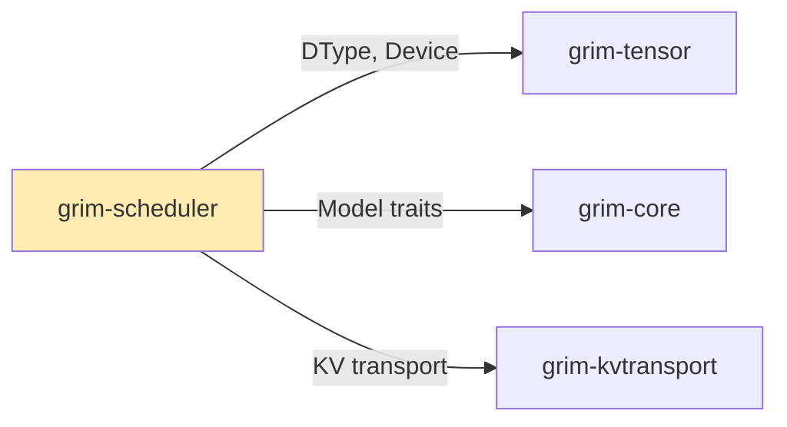

# grim-scheduler

Continuous-batching scheduler with latency-aware admission control for Grim. Three-queue design (waiting/running/swapped) with the AdmissionController per architecture §5.2.

## Purpose

Manages request scheduling for inference serving, implementing continuous batching with:
- Pending request queue (waiting)
- Active request pool (running)  
- Swapped-out requests (swapped)

Provides latency-aware admission control to balance throughput and latency.

## Boundaries

- Does not perform actual inference — delegates to `grim-engine`
- Does not manage memory — delegates to `grim-memory`
- Does not handle KV cache operations — see `grim-kvtransport`

## Dependency Graph



## Public API

### Scheduler

```rust
pub struct Scheduler {
    pub waiting: Vec<Request>,
    pub running: Vec<Request>,
    pub swapped: Vec<Request>,
    pub max_batched_tokens: usize,
    pub chunked_prefill_size: usize,
}

pub struct Request {
    pub id: u64,
    pub prompt_tokens: u64,
    pub priority: i32,
    pub consumed_tokens: u64,
    pub model_id: Option<String>,
    pub adapter_ids: Vec<u32>,
    pub input_ids: Option<Vec<u32>>,
}

impl Scheduler {
    pub fn new(max_batched_tokens: usize, max_num_seqs: usize, 
               admission: AdmissionController) -> Self;
    pub fn schedule(&mut self) -> SchedulerOutput;
    pub fn enqueue(&mut self, req: Request);
    pub fn is_paused(&self, id: u64) -> bool;
    pub fn pause_request(&mut self, id: u64) -> bool;
    pub fn resume_request(&mut self, id: u64) -> bool;
}
```

### SchedulerOutput

```rust
pub struct SchedulerOutput {
    pub prefill_ids: Vec<u64>,
    pub decode_ids: Vec<u64>,
    pub adapter_batches: HashMap<u32, Vec<u64>>,
    pub kv_transport_ops: Vec<KvTransportOp>,
}
```

### AdmissionController

```rust
pub struct AdmissionController {
    // Configurable thresholds per architecture §5.2
}

impl AdmissionController {
    pub fn new(target_ttft_ms: f64, target_itl_ms: f64) -> Self;
    pub fn should_admit(&self, request: &Request, scheduler_state: &Scheduler) -> bool;
    pub fn record_ttft(&mut self, ttft_ms: f64);
    pub fn record_itl(&mut self, itl_ms: f64);
}
```

## Usage Example

```rust
use grim_scheduler::{Scheduler, Request, AdmissionController};

let admission = AdmissionController::new(2000.0, 100.0);
let mut scheduler = Scheduler::new(4096, 8, admission);

let req = Request {
    id: 1,
    prompt_tokens: 512,
    priority: 0,
    consumed_tokens: 0,
    model_id: Some("llama3".to_string()),
    adapter_ids: vec![],
    input_ids: Some(vec![1, 2, 3, 4]),
};

scheduler.enqueue(req);
let output = scheduler.schedule();
```

## Feature Flags

This crate has no feature flags.

## Edge Cases

1. **Swapped requests**: Large requests that exceed memory are moved to swapped queue
2. **Prefill chunking**: Large prefills are chunked to fit `chunked_prefill_size`
3. **Self-tuning**: AdaptationController uses exponential moving average for latency tracking