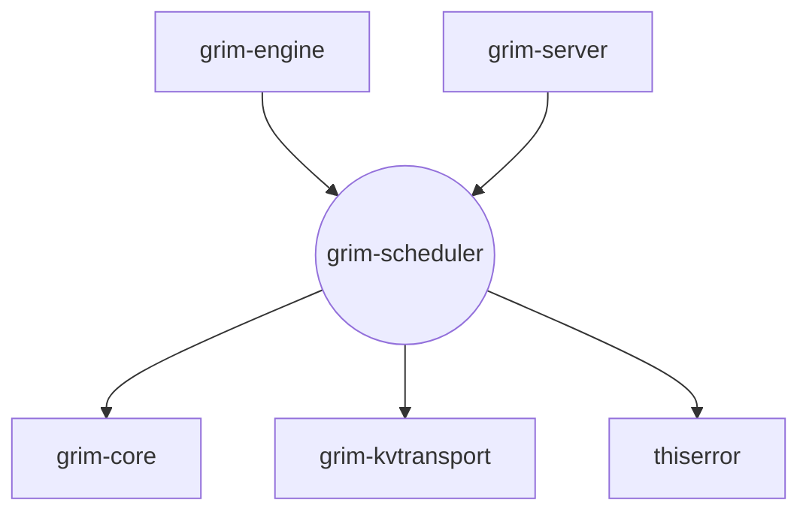

# grim-scheduler

## Purpose
The `grim-scheduler` crate provides a continuous-batching execution scheduler tailored for LLM inference. It manages request queues (waiting, running, swapped, paused), applies chunked prefill policies (Sarathi-Serve style), and enforces latency-aware admission control to respect strict Time-To-First-Token (TTFT) and Inter-Token-Latency (ITL) budgets.

## Boundaries
This crate acts purely as a decision-making and routing layer. It does *not* execute models or allocate KV cache memory. It takes in requests, observes engine throughput estimates via the `AdmissionController`, and produces a `SchedulerOutput` dictating exactly which sequences should prefill, decode, or be preempted on the current engine tick. It also handles grouping sequences by LoRA adapter ID for fused batch dispatches.

## Dependency Graph


## Public API Overview
- **`Scheduler`**: The core struct managing the execution queues and evaluating which requests can proceed based on max batch limits and pressure heuristics.
- **`AdmissionController`**: Predictive module estimating TTFT/ITL against configured budgets to either `Admit` or `Defer` incoming requests.
- **`Request`**: Represents a generation task, tracking its priority, tokens consumed (for chunked prefill), target model, and active adapter IDs.
- **`SchedulerOutput`**: The per-tick execution plan detailing `prefill_ids`, `decode_ids`, `preempted_ids`, and `adapter_batches`.
- **`plan_hybrid_attention_step`**: Resolves which physical blocks belong on-device vs. on-host for hybrid CPU/GPU attention offload.
- **`self_tuning::*`**: PID-style tuning controllers for dynamically adjusting prefill chunk sizes and batch limits based on observed hardware latencies.

## Usage Example
```rust
use grim_scheduler::{AdmissionController, Scheduler, Request};

fn main() {
    // Target 2000ms TTFT, 100ms ITL
    let admission = AdmissionController::new(2000, 100);
    
    // Max 4096 batched tokens, max 8 concurrent sequences
    let mut scheduler = Scheduler::new(4096, 8, admission);
    
    // Enqueue a request
    scheduler.enqueue(Request {
        id: 1,
        prompt_tokens: 128,
        priority: 0,
        consumed_tokens: 0,
        ..Default::default()
    });
    
    // Decide what to run on this tick
    let output = scheduler.schedule();
    println!("Prefill IDs: {:?}", output.prefill_ids);
}
```

## Use Cases
- Orchestrating multi-user request streams in an OpenAI-compatible serving backend.
- Managing speculative decoding sessions where sequences might pause, resume, or swap to the host due to KV cache pressure.
- Dynamically tuning batch sizes (`self_tuning`) to maintain consistent latency when deploying unknown models on diverse hardware.

## Edge Cases, Limitations, and Quirks
- **Solo-Prompt Livelock Bypass**: If a single request's prompt is so massive that its predicted TTFT alone exceeds the admission target, the scheduler will forcibly admit it if the queue is empty, preventing permanent livelock.
- **Preemption Priority**: When token pressure forces preemption, the lowest priority requests are swapped to host memory first.
- **Determinism Mode**: If configured for `Strict` determinism, the scheduler sorts queues deterministically by request ID before making scheduling decisions, slightly altering the natural first-in-first-out flow.

## Build Flags, Feature Flags, and Environment Variables
- **Features**: Defaults to an empty `default = []` feature set. No specific environment variables are read directly by this crate (tuning targets are passed in by the caller).
