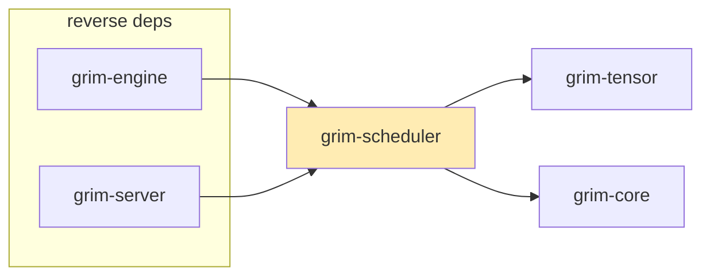

# grim-scheduler

Continuous-batching request scheduler with latency-aware admission control and self-tuning.

## Purpose

Manages which inference requests run in each batch. Maintains four queues — `waiting` (pending), `running` (active), `paused` (KV retained, §5.2.1), and `swapped` (evicted under memory pressure) — and decides which requests to admit via an `AdmissionController` that predicts TTFT and ITL. The scheduler also handles chunked prefill, LoRA adapter sub-batching, preemption, and self-tuning of batch parameters via `SelfTuningController`.

## Boundaries

- Does **not** perform tensor computation — delegates to `grim-engine`.
- Does **not** manage KV block allocation — see `grim-memory`.
- Does **not** handle HTTP routing — see `grim-server`.

## Dependency Graph



## Public API

```rust
pub struct Request {
    pub id: u64,
    pub prompt_tokens: usize,
    pub priority: i32,
    pub consumed_tokens: usize,
    pub model_id: Option<String>,
    pub adapter_ids: Vec<u32>,
    pub input_ids: Option<Vec<u32>>,
}

impl Default for Request { ... }

pub struct Scheduler {
    pub waiting: VecDeque<Request>,
    pub running: Vec<Request>,
    pub swapped: VecDeque<Request>,
    pub paused: VecDeque<Request>,
    pub max_batched_tokens: usize,
    pub max_num_seqs: usize,
    pub chunked_prefill_size: usize,
    pub admission: AdmissionController,
    pub determinism_mode: grim_core::DeterminismMode,
}

impl Scheduler {
    pub fn new(max_batched_tokens: usize, max_num_seqs: usize,
               admission: AdmissionController) -> Self;
    pub fn enqueue(&mut self, request: Request);
    pub fn schedule(&mut self) -> SchedulerOutput;
    pub fn finish(&mut self, id: u64);
    pub fn pause(&mut self, id: u64) -> bool;
    pub fn resume(&mut self, id: u64) -> bool;
    pub fn is_paused(&self, id: u64) -> bool;
}

pub struct SchedulerOutput {
    pub prefill_ids: Vec<u64>,
    pub decode_ids: Vec<u64>,
    pub preempted_ids: Vec<u64>,
    pub adapter_batches: HashMap<u32, Vec<u64>>,
}

impl SchedulerOutput {
    pub fn is_empty(&self) -> bool;
}

pub enum AdmissionDecision { Admit, Defer }

pub struct AdmissionController {
    pub target_ttft_ms: u64,
    pub target_itl_ms: u64,
    pub throughput_estimate: Mutex<f64>,
}

impl AdmissionController {
    pub fn new(target_ttft_ms: u64, target_itl_ms: u64) -> Self;
    pub fn admit(&self, request: &Request, backlog: &BatchTokenBacklog) -> AdmissionDecision;
    pub fn predict_ttft(&self, prompt_tokens: usize, batch_token_backlog: usize) -> Duration;
    pub fn observe_prefill(&self, prompt_tokens: usize, wall_duration: Duration);
    pub fn observe_decode(&self, decode_tokens: usize, wall_duration: Duration);
}

pub fn plan_hybrid_attention_step(...) -> (Vec<usize>, Vec<u32>);
pub use self_tuning::{SelfTuningController, TunableKnob};
```

## Usage Example

```rust
use grim_scheduler::{Scheduler, Request, AdmissionController};

let admission = AdmissionController::new(2000, 100);
let mut scheduler = Scheduler::new(4096, 8, admission);

scheduler.enqueue(Request {
    id: 1,
    prompt_tokens: 512,
    input_ids: Some(vec![1, 2, 3, 4]),
    ..Default::default()
});
let output = scheduler.schedule();
```

## Feature Flags

This crate has no feature flags.

## Edge Cases, Limitations, and Quirks

- `Scheduler::schedule()` uses a deterministic sort (by request id) — ordering is reproducible across runs in the same state.
- The solo-prompt livelock bypass (§5.2): if a single oversized request is the only one in the backlog, it is admitted regardless of its predicted TTFT — preventing indefinite deferral.
- `paused` queue retains KV blocks (ref-counted); `finish` removes from all queues but does not free session state — that is `Engine::finish_request`'s job (see `grim-engine`).
- `SelfTuningController` adjusts `max_batched_tokens`, `chunked_prefill_size`, speculative block length, and KV compression bit width based on EMA of observed TTFT/ITL.
