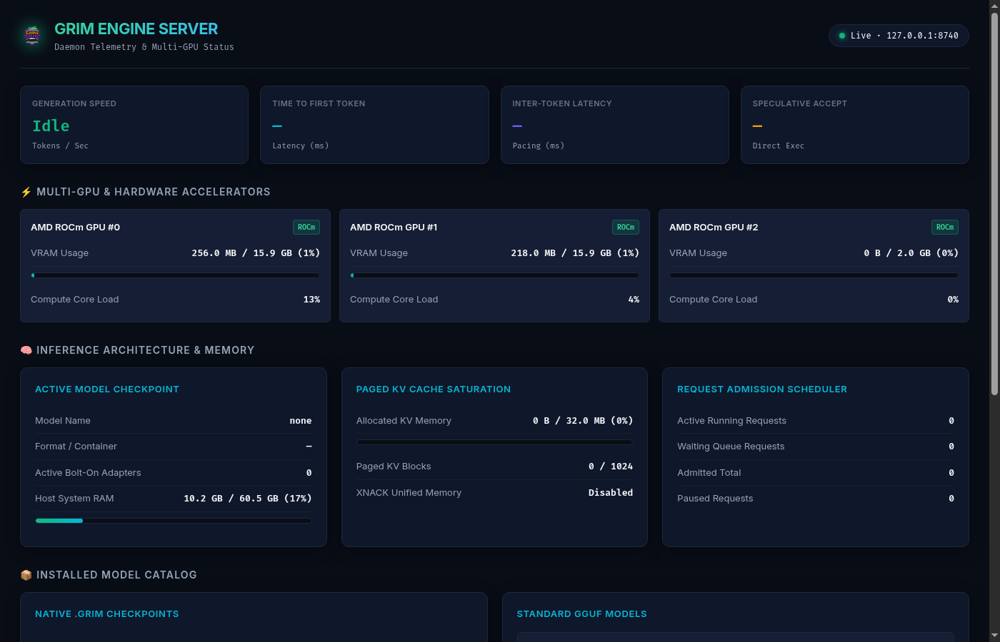

# grim-server

## Purpose
The `grim-server` crate is the front-facing HTTP and gRPC network layer for Grim. Based on the `axum` framework, it serves an OpenAI-compatible `/v1/chat/completions` REST API, executing requests through the central `grim-engine`. It handles routing, concurrent request parsing, SSE stream management, tool calling logic, and dynamic on-demand model loading from the local catalog.

## Boundaries
This crate only translates network payloads into engine requests, and engine outcomes into network responses (like JSON or SSE streams). It executes no tensor logic, allocates no direct hardware memory, and relies completely on the Engine to manage inference state. It also defines strict HTTP routing boundaries and error taxonomy to maintain faithful compatibility with client SDKs.

## Dependency Graph

```mermaid
graph TD
    %% Focal Node
    grim-server(("grim-server"))

    %% Workspace Dependencies
    grim-server --> grim-tensor
    grim-server --> grim-core
    grim-server --> grim-scheduler
    grim-server --> grim-engine
    grim-server --> grim-format
    grim-server --> grim-plugin
    grim-server --> grim-backend-rocm
    grim-server --> grim-backend-cuda
    grim-server --> grim-backend-metal
    grim-server --> grim-backend-vulkan
    grim-server --> grim-backend-cpu
    grim-server --> grim-models-transformer
    grim-server --> grim-disagg
    grim-server --> thiserror

    %% External Dependencies
    grim-server -.-> axum
    grim-server -.-> serde_json
    grim-server -.-> tokio
    grim-server -.-> tokio-util
    grim-server -.-> futures
    grim-server -.-> axum-server
    grim-server -.-> rcgen
    grim-server -.-> serde

    %% Reverse Workspace Dependents (Conceptual)
    grim-cli --> grim-server
```


## Public API Overview
- **`AppState`**: Shared state holding the `Engine` mutex, the active `GgufTokenizer`, the server model path, and the WASM plugin registry.
- **Web UI & Telemetry Dashboard (`/`)**: Built-in dark mode dashboard displaying live generation speed, TTFT, inter-token latency, GPU VRAM allocations, KV cache saturation, admission scheduler metrics, and loaded model catalogs.
- **REST Endpoints**: 
  - `POST /v1/chat/completions`: Main inference endpoint supporting full SSE streaming and strict schema validation.
  - `POST /v1/requests/{id}/pause` & `resume`: Controls sequence execution within the engine's scheduler.
  - `POST /v1/requests/{id}/cancel`: Aborts generation via cancellation tokens.
- **`ErrorCode`**: Stable, machine-actionable error enumeration (e.g. `DuplicateToolCall`, `DeterminismMismatch`) returned in standard `invalid_request_error` JSON bodies.
- **Tool Calling (`tool_parse.rs`)**: Integrates structured parsing of `<think>` and tool invocation tags into `message.tool_calls`.
- **Cancellation**: Implements `CancellationToken` tracking and the `RequestCleanupGuard` RAII struct to prevent KV cache leaks on client disconnects.

## Live Telemetry Dashboard



## Usage Example
```rust
// Internally in `grim-server`'s main application boot:
// 
// let engine = Engine::new(config);
// let state = Arc::new(AppState {
//     engine: Mutex::new(engine),
//     tokenizer: Mutex::new(None),
//     model_path: None,
//     plugin_registry: None,
// });
//
// let app = Router::new()
//     .route("/v1/chat/completions", post(chat_completions))
//     .route("/v1/models", get(list_models))
//     .with_state(state);
//
// axum::serve(listener, app).await.unwrap();
```

## Use Cases
- Standing up a production LLM proxy endpoint for OpenAI-compatible client libraries (like `openai-python` or `LangChain`).
- Enabling tool-calling loops with strict guards (preventing models from repeating identical tool calls endlessly).
- Paging requests off the active GPU dynamically using the pause/resume API.

## Edge Cases, Limitations, and Quirks
- **Strict Parsing Strategy**: The `/v1/chat/completions` endpoint strictly rejects unknown JSON keys immediately (`400 Bad Request`) to catch typos and version skew, rather than silently ignoring them.
- **Remote Provider Routing**: If a requested model string specifies a known proxy prefix (e.g., `ollama:cloud` or `hf/meta-llama`), the server attempts to route the request outbound instead of evaluating locally. However, if the name exactly matches an installed local catalog file, the local model always wins.
- **Tool Calling MVP Constraints**: The buffered tool calling integration MVP suppresses intermediate stream chunks until tool calls are successfully parsed at the end of generation. A hard guard against infinite identical tool loops (`check_repeated_call_hard_guard`) is evaluated before response construction.

## Build Flags, Feature Flags, and Environment Variables
- **Features**: 
  - `default = []`
  - `wasm-sandbox`: Enables the `wasmtime`-backed WASM plugin loader for executing sandboxed sampler scripts during generation.
