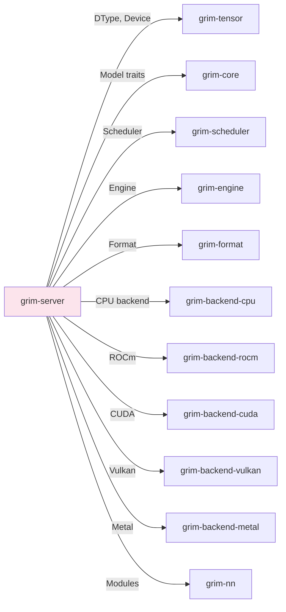

# grim-server

HTTP/gRPC serving layer for Grim — OpenAI-compatible endpoints plus native streaming. axum-based.

## Purpose

Provides inference serving:
- OpenAI-compatible REST API endpoints
- Server-Sent Events (SSE) for native streaming
- gRPC support (when compiled with `grpc` feature)
- Dynamic model loading/unloading

## Boundaries

- Does not perform inference — delegates to `grim-engine`
- Does not manage KV cache directly — through engine
- Dependencies on backends are unconditional (all enabled by default)

## Dependency Graph



## Public API

### AppState

```rust
pub struct AppState {
    pub engine: Mutex<Engine>,
    pub tokenizer: Mutex<Option<GgufTokenizer>>,
    pub model_path: Option<PathBuf>,
}
```

### HTTP Endpoints

| Endpoint | Method | Description |
|---|---|---|
| `/v1/chat/completions` | POST | Chat completion with streaming support |
| `/v1/completions` | POST | Text completion |
| `/v1/embeddings` | POST | Embeddings (not implemented) |
| `/v1/models` | GET | List available models |
| `/v1/models/{id}/load` | POST | Dynamic model loading |
| `/v1/models/{id}` | DELETE | Unload model |
| `/v1/status` | GET | Server status and health |
| `/v1/metrics` | GET | Prometheus metrics |

## Usage Example

```rust
use grim_server::{AppState, health, chat_completions};
use axum::Router;

let state = Arc::new(AppState {
    engine: Mutex::new(Engine::new(config)),
    tokenizer: Mutex::new(None),
    model_path: None,
});

let app = Router::new()
    .route("/health", get(health))
    .route("/v1/chat/completions", post(chat_completions))
    .with_state(state);
```

## Feature Flags

This crate has no feature flags (all backends enabled by default).

## Edge Cases

1. **Model loading**: On-demand loading from model catalog
2. **Unknown request fields**: Returns 400 Bad Request (strict validation)
3. **Determinism mismatch**: Returns 400 if client requests strict but engine is relaxed