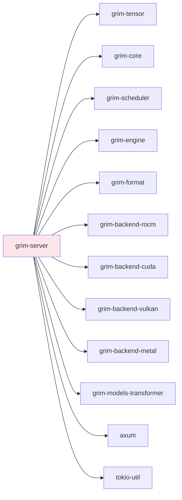

# grim-server

HTTP serving layer for Grim — OpenAI-compatible endpoints plus native SSE streaming. axum-based.

## Purpose

Provides inference serving:
- OpenAI-compatible REST API endpoints (`/v1/chat/completions`, `/v1/completions`, `/v1/embeddings`)
- Server-Sent Events (SSE) for streaming token output via `stream::unfold`
- Request lifecycle management: pause, resume, cancel, and stream state introspection
- Chat-stream interruption (WI-CANCEL) via `CancellationToken` + RAII `Drop` guard
- Tool/function-calling support (WI-TOOLS) with structured error codes
- Request-scoped LoRA adapter routing (§4.5)
- Dynamic model loading/unloading
- Dashboard and Grim REST API compatibility shims

## Boundaries

- Does not perform inference — delegates to `grim-engine`.
- Does not manage KV cache directly — coordinates through `Engine::finish_request`.
- Does not manage tensor computation — depends on backend crates via `grim-engine`.
- All backends (ROCm, CUDA, Vulkan, Metal) are compiled unconditionally — no feature flags.

## Dependency Graph



## Public API

### State & Lifecycle

```rust
pub struct AppState {
    pub engine: Mutex<Engine>,
    pub tokenizer: Mutex<Option<grim_format::GgufTokenizer>>,
    pub model_path: Option<std::path::PathBuf>,
}

/// RAII guard ensuring `Engine::finish_request(id)` runs exactly once
/// when the streaming SSE future is dropped — covering normal completion,
/// explicit cancel, and client disconnect paths. WI-CANCEL-2.
pub struct RequestCleanupGuard { /* fields private */ }

impl RequestCleanupGuard {
    pub fn new(state: Arc<AppState>, request_id: u64) -> Self;
}

pub static LIVE_CLEANUP_GUARDS: AtomicUsize;

/// Cancellation token registry for active chat requests. WI-CANCEL-1.
pub fn register_cancel_token(request_id: u64) -> CancellationToken;
pub fn take_cancel_token(request_id: u64) -> Option<CancellationToken>;
```

### Error Codes

```rust
pub enum ErrorCode {
    UnknownField,
    AdapterNotFound,
    DeterminismMismatch,
    EmptyMessages,
    DuplicateToolCall,
    TotalToolCallLimit,
    MessageCountLimit,
}

impl ErrorCode {
    pub fn as_str(&self) -> &'static str;
}
```

### Router & Server

```rust
pub fn build_router(state: Arc<AppState>) -> Router;

pub async fn serve(
    addr: &str,
    engine: Engine,
    model_path: Option<std::path::PathBuf>,
) -> Result<()>;
```

## HTTP Endpoints

| Method | Path | Description |
|--------|------|-------------|
| `GET` | `/health` | Health check |
| `GET` | `/status` | Server status and health |
| `GET` | `/metrics` | Prometheus-style metrics |
| `GET` | `/` | Dashboard UI |
| `GET` | `/v1/models` | List available models |
| `POST` | `/v1/models/load` | Dynamic model loading |
| `POST` | `/v1/models/unload` | Unload model |
| `POST` | `/v1/chat/completions` | Chat completion with SSE streaming + tool calls |
| `POST` | `/v1/completions` | Text completion |
| `POST` | `/v1/embeddings` | Embeddings (stub — returns 501) |
| `POST` | `/v1/audio/transcriptions` | Audio transcription (stub) |
| `POST` | `/v1/images/generations` | Image generation (stub) |
| `POST` | `/v1/requests/:id/pause` | Pause a running request (§5.2.1) |
| `POST` | `/v1/requests/:id/resume` | Resume a paused request (§5.2.1) |
| `POST` | `/v1/requests/:id/cancel` | Cancel a streaming request (WI-CANCEL-1/2) |
| `GET` | `/v1/requests/:id/stream` | Stream request state |
| `GET` | `/grpc` | gRPC service handler (stub) |

### Grim REST API Compatibility Shims

| Method | Path | Description |
|--------|------|-------------|
| `POST` | `/api/chat` | Chat (compat shim) |
| `POST` | `/api/generate` | Generate (compat shim) |
| `GET` | `/api/tags` | Tags (compat shim) |
| `POST` | `/api/pull` | Pull model (compat shim) |
| `GET` | `/api/stats` | Aggregated stats |

## Usage Example

```rust
use std::sync::Arc;
use std::sync::Mutex;
use grim_server::{AppState, build_router, serve};
use grim_engine::Engine;

let state = Arc::new(AppState {
    engine: Mutex::new(Engine::new(config)),
    tokenizer: Mutex::new(None),
    model_path: None,
});

let app = build_router(state);
serve("127.0.0.1:11434", engine, model_path).await?;
```

## Streaming Cancellation (WI-CANCEL)

Chat-stream interruption is implemented across three layers:

- **WI-CANCEL-0**: `/v1/requests/:id/cancel` route registered in `build_router`.
- **WI-CANCEL-1**: Each streaming request registers a `CancellationToken` via `register_cancel_token`. The cancel endpoint calls `take_cancel_token` and signals cancellation.
- **WI-CANCEL-2**: A `RequestCleanupGuard` is threaded into the `stream::unfold` state tuple. Its `Drop` impl calls `engine.finish_request(request_id)` exactly once — covering normal completion, explicit cancel (token set), and client disconnect (stream dropped).
- **WI-CANCEL-3**: The `unfold` closure checks the cancel token at the top of each poll step and returns `None` on cancellation.

## Feature Flags

This crate has no feature flags — all GPU backends (ROCm, CUDA, Vulkan, Metal) are compiled unconditionally.

## Edge Cases, Limitations, and Quirks

- **Adapter routing (§4.5)**: The `"adapters"` key in the request body accepts a JSON array of adapter names. Unknown names return 400 immediately — fail loudly rather than silently drop.
- **Determinism mismatch**: If `determinism: "strict"` is requested but the engine is in Relaxed mode, returns 400.
- **Unknown request fields**: Strict validation — unknown top-level keys return 400 with the offending key name.
- **Body limit**: Maximum request body size is 10 MB (set via `DefaultBodyLimit`).
- **Embedding endpoint**: `/v1/embeddings` is registered but returns 501 Not Implemented.
