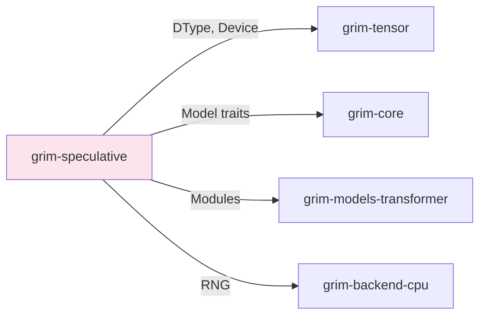

# grim-speculative

Default-on speculative decoding for Grim. DSpark-style semi-autoregressive drafter + Markov head + confidence head + Zero-config MTP path. §5.3.

## Purpose

Implements speculative decoding to improve throughput:
- DSpark-style draft model for parallel token generation
- Markov head predicts likely next tokens
- Confidence head estimates acceptance probability

Speculative decoding is enabled by default in `grim-engine`.

## Boundaries

- Does not perform actual inference — only coordinates draft/verify passes
- Does not define the Model trait — see `grim-core`
- Does not manage KV cache — see `grim-memory`

## Dependency Graph



## Public API

### SpeculativeCausalLm

```rust
pub struct SpeculativeCausalLm {
    base: Box<dyn CausalLm>,
    draft: Option<Arc<dyn DraftBackbone>>,
    markov: Option<Arc<dyn MarkovHead>>,
    confidence: Option<Arc<dyn ConfidenceHead>>,
    strategy: Strategy,
}

pub enum Strategy {
    Plain,          // No speculation
    NativeMtp,      // Multi-token prediction
    Dspark,         // DSpark-style draft model
}

impl SpeculativeCausalLm {
    pub fn auto(base: Box<dyn CausalLm>, draft: Option<Arc<dyn DraftBackbone>>,
                markov: Option<Arc<dyn MarkovHead>>, confidence: Option<Arc<dyn ConfidenceHead>>,
                is_weight_streaming: bool, available_vram: Option<usize>) -> Self;
    
    pub fn strategy(&self) -> Strategy;
    pub fn forward(&mut self, positions: &[u32], input_ids: &[u32],
                   past: Option<&dyn KvCache>, adapters: &[AdapterHandle]) -> Result<SpeculativeOutput>;
}
```

### SpeculativeOutput

```rust
pub struct SpeculativeOutput {
    pub logits: Tensor,
    pub accepted_tokens: usize,
    pub total_tokens: usize,
}
```

## Usage Example

```rust
use grim_speculative::SpeculativeCausalLm;

let speculative_model = SpeculativeCausalLm::auto(
    base_model,
    Some(draft_model),
    Some(markov_head),
    Some(confidence_head),
    false, // not weight streaming
    None,  // no VRAM constraint
);

// Engine automatically wraps causal models
let output = speculative_model.forward(&positions, &input_ids, None, &[])?;
```

## Feature Flags

This crate has no feature flags.

## Edge Cases

1. **Fallback on missing heads**: If draft/markov/confidence not provided, falls back to plain autoregressive
2. **Acceptance criteria**: Tokens accepted based on confidence head threshold
3. **MTP path**: Zero-config multi-token prediction path available