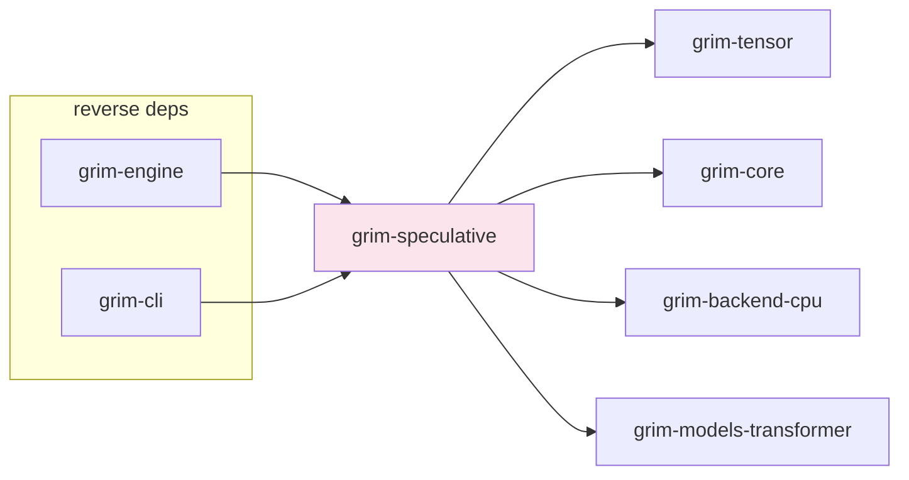

# grim-speculative

Default-on speculative decoding for Grim. Wraps a `CausalLm` with automatic strategy selection: Native MTP (zero-config), DSpark (draft + Markov + confidence), or plain autoregressive fallback. §5.3.

## Purpose

Implements speculative decoding to reduce the number of target-model forward passes per generated token. `SpeculativeCausalLm` wraps any `CausalLm` and selects a strategy at construction time: Native MTP when the target model exposes multi-token prediction heads, DSpark when a draft/Markov/confidence bundle is attached, or plain autoregressive when neither is available or VRAM pressure forces fallback.

## Boundaries

- Does not perform the actual model forward pass — delegates to the wrapped `CausalLm` target.
- Does not manage KV cache — shares the target's `KvCache`.
- Does not define the `Model` trait — see `grim-core`.
- Does not implement full gradient-based draft training — `train_speculative_draft` is a stub interface; see `distill` module.

## Dependency Graph



## Public API

```rust
pub use confidence_head::ConfidenceHead;
pub use confidence_scheduler::{ConfidenceScheduler, SpeculationConfig, ThroughputProfile};
pub use distill::train_speculative_draft;
pub use draft_backbone::{DraftBackbone, DraftBlock};
pub use entropy_confidence_head::EntropyConfidenceHead;
pub use llama_mtp_adapter::LlamaMtpAdapter;
pub use mamba_speculative::{MambaSpeculativeEngine, MambaStepState};
pub use markov_head::MarkovHead;
pub use native_mtp::NativeMtp;
pub use speculative_wrapper::{SpeculativeCausalLm, Strategy};
pub use tiny_draft_backbone::TinyDraftBackbone;
pub use uniform_markov_head::UniformMarkovHead;
```

### Strategy Selection

```rust
pub enum Strategy {
    Plain,      // No speculation — pure autoregressive
    DSpark,     // DSpark path: draft + Markov + confidence heads
    NativeMtp,  // Native MTP: target implements NativeMtp
}
```

### Construction

```rust
impl SpeculativeCausalLm {
    pub fn plain(target: Box<dyn CausalLm>) -> Self;
    pub fn with_dspark(
        target: Box<dyn CausalLm>,
        draft: Arc<dyn DraftBackbone>,
        markov: Arc<dyn MarkovHead>,
        confidence: Arc<dyn ConfidenceHead>,
        scheduler: ConfidenceScheduler,
    ) -> Self;
    pub fn with_native_mtp(
        target: Box<dyn CausalLm>,
        mtp_target: Arc<dyn NativeMtp>,
    ) -> Self;
    pub fn auto(
        target: Box<dyn CausalLm>,
        draft: Option<Arc<dyn DraftBackbone>>,
        markov: Option<Arc<dyn MarkovHead>>,
        confidence: Option<Arc<dyn ConfidenceHead>>,
        is_weight_streaming_active: bool,
        available_vram_bytes: Option<usize>,
    ) -> Self;
    pub fn strategy(&self) -> Strategy;
}
```

### Traits

```rust
pub trait DraftBackbone: Send + Sync {
    fn draft_block(
        &self,
        session: &mut dyn grim_core::session::SessionT,
        context: &Tensor,
        block_len: usize,
    ) -> Result<DraftBlock>;
    fn estimated_footprint_bytes(&self) -> usize;
    fn update_weights(
        &self,
        target_hidden_states: &[f32],
        draft_tokens: &[u32],
        accepted_mask: &[bool],
    ) -> Result<()>;
}

pub trait ConfidenceHead: Send + Sync {
    fn score(&self, draft_block: &DraftBlock) -> Vec<f32>;
}

pub trait MarkovHead: Send + Sync {
    fn bias(&self, prefix_within_block: &[u32], base_logits: &Tensor) -> Result<Tensor>;
}

pub trait NativeMtp: grim_core::CausalLm {
    fn as_causal_lm(&self) -> &dyn grim_core::CausalLm;
    fn mtp_depth(&self) -> usize;
    fn predict_multi(
        &self,
        session: &mut dyn grim_core::session::SessionT,
        input_ids: &Tensor,
        positions: &Tensor,
    ) -> Result<DraftBlock>;
}
```

### Data Types

```rust
pub struct DraftBlock {
    pub tokens: Vec<u32>,
    pub base_logits: Tensor,      // (block_len, vocab)
    pub confidence: Vec<f32>,     // one per token slot
}

pub struct ConfidenceScheduler {
    pub throughput_profile: ThroughputProfile,
    pub config: SpeculationConfig,
    pub adaptation_state: AdaptationState,
    pub adaptation_config: AdaptationConfig,
}

pub struct MambaStepState {
    pub step: usize,
    pub ssm_state: Vec<f32>,
    pub conv_state: Vec<f32>,
}
```

### Draft Training (Stub Interface)

```rust
pub fn train_speculative_draft(
    target_path: &str,
    output_path: &str,
    dataset_path: &str,
) -> Result<()>;
```

## Usage Example

```rust
use grim_speculative::{SpeculativeCausalLm, Strategy};

let speculative_model = SpeculativeCausalLm::auto(
    base_model,
    Some(draft_model),
    Some(markov_head),
    Some(confidence_head),
    false,  // is_weight_streaming_active
    None,   // available_vram_bytes
);

assert_eq!(speculative_model.strategy(), Strategy::DSpark);
```

## Edge Cases, Limitations, and Quirks

- If weight streaming is active and the draft model exceeds available VRAM, `auto()` falls back to `Plain` to avoid a serialization crash — this is a runtime decision, not a compile-time one.
- DSpark requires all three bundle components (draft, Markov, confidence) — a partial bundle falls back to Plain.
- Native MTP is selected only if the target implements `NativeMtp` directly (e.g., models from `grim-models-transformer`). `LlamaMtpAdapter` in this crate wraps a `CausalLm` to expose `NativeMtp` for Llama-family models.
- `train_speculative_draft` is a defined interface (WI 4.4.3) but does not yet implement full gradient-based training — it materializes stub artifacts and delegates to `TinyDraftBackbone` for smoke-testing.
- `MambaSpeculativeEngine` is a separate utility for Mamba architecture state rollback during draft rejection — it is not used by `SpeculativeCausalLm` directly, but provides per-step SSM/conv state save/restore.
