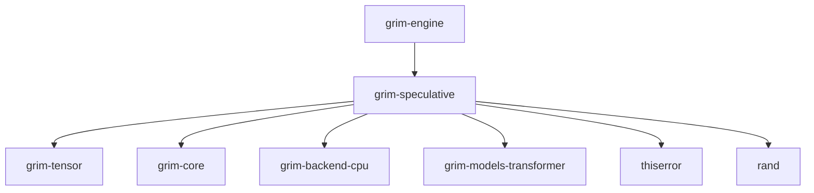

# grim-speculative

## Purpose
Provides default-on speculative decoding for Grim. The crate supports DSpark-style semi-autoregressive drafting and native multi-token prediction (MTP) to accelerate inference.

## Boundaries
- Modifies how generation occurs.
- Does not define the base transformer or mamba blocks (handled in `grim-models-*`).
- Does not define backends.

## Dependency Graph


## Public API Overview
- `Strategy`: Enum defining speculation modes.
- `SpeculativeCausalLm`: Wrapper struct handling speculative generation.
- `NativeMtp`: Trait for models supporting zero-config multi-token prediction.
- `DraftBackbone`, `MarkovHead`, `ConfidenceHead`: Core structs for the DSpark drafting approach.
- `train_speculative_draft`: Distillation function for QAT-aware drafting bundles.
- `ConfidenceScheduler`: Controls acceptance thresholds.

## Usage Example
```rust
use grim_speculative::{SpeculativeCausalLm, Strategy};
// Assuming base_model is a compatible model instance:
// let speculative_model = SpeculativeCausalLm::new(base_model, Strategy::NativeMtp);
```

## Use Cases
- Accelerating generation speed for compatible models.
- Running multi-token prediction models (like Gemma-4 or DeepSeek V3).
- Distilling and applying custom DSpark drafters for specialized deployments.

## Edge Cases, Limitations, and Quirks
- DSpark drafter requires a matched training distillation step via `grim spec train` (it must target the exact QAT checkpoint).
- Native MTP relies on the base model correctly implementing the `NativeMtp` trait.
- If speculative decoding confidence is too low, it automatically falls back to plain autoregressive behavior.

## Build Flags, Feature Flags, and Environment Variables
- `default`: No special features.
