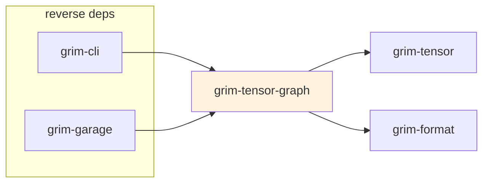

# grim-tensor-graph

Checkpoint-derived tensor graph IR and fusion-pattern detection. Analyzes named-tensor lists to identify fusable op sequences (RmsNorm + MatMul, QKV projection, attention) and emit backend-specific fusion hints.

## Purpose

Provides an IR for detecting fusion opportunities in compiled transformer graphs. Takes a list of tensor names (from a loaded checkpoint), constructs a `ComputationGraph` with `GraphNode` entries keyed by op type, identifies `FusionSequence` candidates, and produces `TensorGraphIr` with fusion groups that the ROCm backend applies.

## Boundaries

- Is a read-only analysis tool — does not execute kernels.
- Does **not** load checkpoints directly — callers pass tensor name lists; checkpoint loading is `grim-format`'s role.
- Does **not** perform inference.

## Dependency Graph



## Public API

```rust
pub use ir::{ComputationGraph, FusionSequence, GraphNode, OpType};

pub enum OpType {
    MatMul,
    RmsNorm,
    QkvProjection,
    AttentionScore,
    Linear,
}

pub struct GraphNode {
    pub id: usize,
    pub op_type: OpType,
    pub input_tensors: Vec<String>,
    pub output_tensor: String,
    pub shape: Option<Shape>,
    pub dtype: ArithType,
}

pub struct ComputationGraph {
    pub nodes: Vec<GraphNode>,
    pub entry_points: Vec<String>,
    pub fusion_candidates: Vec<FusionSequence>,
}

pub struct FusionSequence {
    pub ops: Vec<OpType>,
    pub target_backend_op: String,
}

pub struct TensorGraphIr {
    pub nodes: Vec<String>,
    pub fusion_groups: Vec<FusionGroup>,
}

pub struct FusionGroup {
    pub op: grim_format::gguf::GrimFusionOp,
    pub tensors: Vec<String>,
}

pub fn build_transformer_ir(tensor_names: &[&str]) -> TensorGraphIr;

impl TensorGraphIr {
    pub fn recommended_fusion_ops(&self) -> Vec<GrimFusionOp>;
}
```

## Usage Example

```rust
use grim_tensor_graph::build_transformer_ir;

let names = [
    "blk.0.attention_norm.weight",
    "blk.0.attention.wq.weight",
    "blk.0.attention.wk.weight",
    "blk.0.attention.wv.weight",
];
let ir = build_transformer_ir(&names);
let ops = ir.recommended_fusion_ops();
```

## Feature Flags

This crate has no feature flags.

## Edge Cases, Limitations, and Quirks

- Fusion detection uses substring matching on tensor names (e.g., `"attention_norm"`, `"self_attn.q_proj"`) — names must follow the conventions used in `grim-models-*` checkpoints.
- `recommended_fusion_ops` returns only one entry per `GrimFusionOp` variant, even if multiple fusion groups match.
