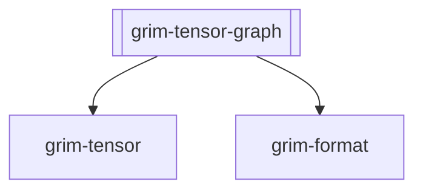

## Purpose
The `grim-tensor-graph` crate provides an intermediate representation (IR) for analyzing and optimizing computational graphs derived from model checkpoints. It specializes in detecting tensor fusion patterns, combining multiple sequential operations into fused variants for optimal hardware execution.

## Boundaries
This crate is an analytical layer. It builds IR graphs and pattern-matches them, returning structural optimization suggestions. It does not execute the graphs, nor does it interact with any hardware backend directly. It strictly operates on metadata (tensor names and operator intents) parsed from checkpoints.

## Dependency Graph


## Public API Overview
- `TensorGraphIr`: Represents the computational graph with extracted nodes and fusion groups.
- `ComputationGraph` / `FusionSequence` / `GraphNode` / `OpType`: Core IR structs representing node connectivity and operator categories.
- `FusionGroup`: Represents a set of tensors flagged for kernel fusion (e.g., Q, K, V projections).
- `build_transformer_ir`: Analyzes an iterator of tensor names and constructs a `TensorGraphIr`.

## Usage Example
```rust
use grim_tensor_graph::{build_transformer_ir, TensorGraphIr};

let tensor_names = vec![
    "blk.0.attention_norm.weight",
    "blk.0.attention.wq.weight",
    "blk.0.attention.wk.weight",
    "blk.0.attention.wv.weight",
];

let ir: TensorGraphIr = build_transformer_ir(tensor_names.iter().map(AsRef::as_ref));
let fusions = ir.recommended_fusion_ops();

println!("Recommended fusions: {:?}", fusions);
```

## Use Cases
- Inspecting GGUF checkpoints during load time to find structural optimization opportunities.
- Identifying sets of individual linear projections (e.g., Q, K, V) that can be merged into a single fused QKV kernel.
- Recognizing patterns like RMSNorm + MatMul that can be fused on supporting backends.

## Edge Cases, Limitations, and Quirks
- The pattern matching heavily relies on string sub-matching of tensor naming conventions (e.g., `attn_q.weight`, `attention_norm`). Checkpoints with non-standard naming schemas may evade detection.
- Fusions are "recommended" and not strictly enforced; the engine executing the graph must ultimately respect the detected groups.

## Build Flags, Feature Flags, and Environment Variables
- `default`: No default features are enabled.
