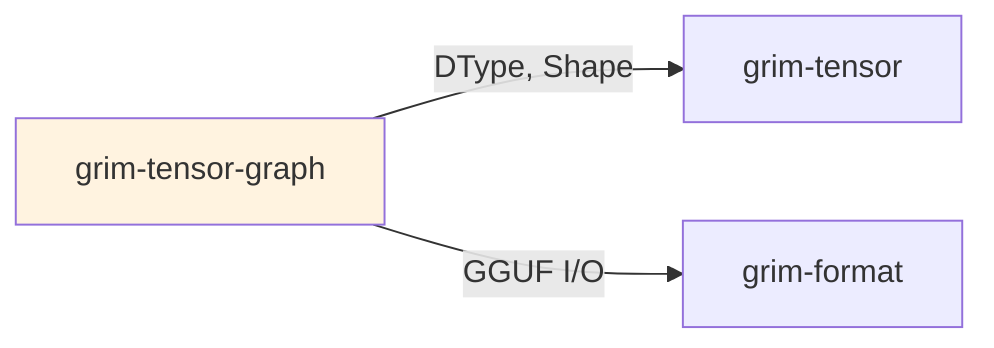

# grim-tensor-graph

Checkpoint-derived tensor graph IR and fusion-pattern detection for Grim.

## Purpose

Analyzes tensor operations for optimization:
- Builds IR from checkpoint computation graphs
- Detects fusion opportunities for kernel optimization
- Provides hints for kernel selection

## Boundaries

- Is a read-only analysis tool — does not execute kernels
- Depends on `grim-format` for checkpoint loading
- Does not perform inference

## Dependency Graph



## Public API

### TensorGraph

```rust
pub struct TensorGraph {
    pub nodes: Vec<GraphNode>,
    pub edges: Vec<GraphEdge>,
}

pub struct GraphNode {
    pub id: usize,
    pub op: OpType,
    pub inputs: Vec<usize>,
    pub outputs: Vec<usize>,
}

pub enum OpType {
    MatMul,
    Add,
    Mul,
    Relu,
    // ...
}

impl TensorGraph {
    pub fn from_checkpoint(path: &Path) -> Result<Self>;
    pub fn detect_fusion_patterns(&self) -> Vec<FusionPattern>;
}
```

## Feature Flags

This crate has no feature flags.

## Edge Cases

1. **Fusion detection**: Identifies patterns like GEMM+Bias+Activation
2. **ROCm hints**: Fusion patterns use vendor-specific kernel hints for ROCm backends