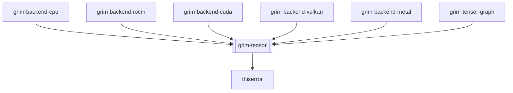

## Purpose
The `grim-tensor` crate provides the core abstractions for tensor computation within the Grim inference engine. It defines the foundational types for shapes, data types, and the backend-agnostic trait contracts that all hardware backends must implement to participate in the engine's execution graph.

## Boundaries
This crate is strictly an abstraction layer. It defines *what* a tensor is and *how* backends should behave, but it does not implement hardware-specific tensor operations itself. Concrete memory allocation, kernel dispatch, and linear algebra routines are delegated to the specific backend crates (`grim-backend-cpu`, `grim-backend-rocm`, etc.) which implement the traits defined here.

## Dependency Graph


## Public API Overview
- `Tensor`: The main tensor struct, holding shape, dtype, and a boxed `BackendStorage`.
- `Shape`: Represents multi-dimensional tensor geometries.
- `DType`: Defines data types, combining arithmetic representation (`ArithType`) and storage representation (`Storage`, including native, KQuant, Block, FloatPack/MXFP4, W4A16, GroupInt/GPTQ, WNA16, CompressedTensors W8A8 Int8/Fp8, and AWQ via `AwqStorageConfig`).
- `BackendDevice`: Trait for device capabilities, allocation, dense & quantized GEMM, fused MoE dispatch, and kernel dispatch.
- `BackendStorage`: Trait for backend-specific tensor memory management.
- `ComputeHandle`: Trait representing asynchronous computation progress and synchronization.
- `SoftmaxPartial`: Utilities for distributed or split-k softmax reduction.

## Usage Example
```rust
use grim_tensor::{Shape, Tensor};
use grim_tensor::dtype::{DType, ArithType};

fn inspect_tensor(tensor: &Tensor) {
    let shape: &Shape = tensor.shape();
    let dtype: DType = tensor.dtype();
    
    println!("Tensor shape: {:?}", shape);
    if dtype.is_quantized() {
        println!("Tensor is quantized.");
    }
}
```

## Use Cases
- Standardizing the representation of neural network weights and activations across diverse hardware environments.
- Establishing the trait boundaries required to write generic inference code that functions on CPU, GPU, and other accelerators identically.
- Handling shape mathematics and broadcasting logic independently of kernel execution.

## Edge Cases, Limitations, and Quirks
- The crate defines the types but relies heavily on dynamic dispatch (trait objects like `Box<dyn BackendStorage>`) to allow heterogeneous multi-backend execution.
- Implementing a new backend requires fulfilling the extensive contract of `BackendDevice` and `BackendStorage`.

## Build Flags, Feature Flags, and Environment Variables
- `default`: No default features are enabled.
