# grim-tensor

Tensor data structure, data types, shapes, storage backends, and the backend-agnostic trait contracts that the rest of the workspace implements against.

## Purpose

Defines the fundamental tensor abstraction used across every other crate: `Tensor`, `Shape`, `DType`, `Device`, and the `TensorProvider`, `BackendStorage`, `BackendDevice`, and `ComputeHandle` traits that backend crates fulfill. This crate is backend-agnostic — it declares the contracts; backends (`grim-backend-rocm`, `grim-backend-cuda`, `grim-backend-vulkan`, `grim-backend-metal`, `grim-backend-cpu`) provide concrete implementations.

## Boundaries

- Does **not** implement any compute kernels — those live in `grim-backend-*` crates.
- Does **not** define neural-network modules — see `grim-nn`.
- Does **not** load model weights — see `grim-format`.
- Does **not** perform inference or scheduling — see `grim-engine`.

## Dependency Graph

```mermaid
graph TB
    A[grim-tensor]
    A[grim-tensor] --> B[grim-backend-cpu]
    A --> C[grim-backend-rocm]
    A --> D[grim-backend-cuda]
    A --> E[grim-backend-vulkan]
    A --> F[grim-backend-metal]
    A --> G[grim-core]
    A --> H[grim-nn]
    A --> I[grim-format]
    A --> J[grim-quant]
    A --> K[grim-plugin]
    A --> L[grim-memory]
    A --> M[grim-kvquant]
    A --> N[grim-kvtransport]
    A --> O[grim-scheduler]
    A --> P[grim-engine]
    A --> Q[grim-server]
    A --> R[grim-autograd]
    A --> S[grim-speculative]
    A --> T[grim-disagg]
    A --> U[grim-tensor-graph]
    A --> V[grim-models-audio]
    A --> W[grim-models-diffusion]
    A --> X[grim-models-mamba]
    A --> Y[grim-models-transformer]
    A --> Z[grim-models-vision]

    style A fill:#e8f5e9
```



## Public API

### Core Types

```rust
pub struct Tensor { /* fields: data, shape, dtype, device */ }
```

```rust
pub enum Device {
    Cpu,
    Gpu(usize),
    Vulkan,
    Metal(usize),
}
```

```rust
pub enum DType {
    pub arith: ArithType,
    pub storage: Storage,
}

pub enum ArithType { F32, F16, BF16, I64, U32, U8 }

pub enum Storage {
    Native,
    KQuant(KQuantScheme),
    GroupInt(GpuIntConfig),
    FloatPack(FloatPackScheme),
    Block(BlockDtype),
}
```

```rust
pub struct Shape(Vec<usize>);
```

### Backend Traits

```rust
pub trait BackendDevice: Send + Sync {
    fn alloc(&self, bytes: usize) -> Result<Box<dyn BackendStorage>>;
    fn gemm_f32(&self, ...) -> Result<()>;
    fn sync(&self);
}
```

See `src/backend.rs` for the full trait surface. The trait is intentionally broad — backends override only the operations they support.

```rust
pub trait BackendStorage: Send + Sync {
    fn data(&self) -> &[u8];
    fn as_mut_ptr(&mut self) -> *mut u8;
}
```

```rust
pub trait ComputeHandle: Send {
    fn synchronize(&self) -> Result<()>;
    fn is_ready(&self) -> bool;
}

pub struct ReadyHandle; // Synchronous backend sentinel
```

```rust
pub trait TensorProvider: Send + Sync {
    fn read_f32(&self, name: &str) -> Result<Vec<f32>>;
    fn read_raw(&self, name: &str) -> Result<&[u8]>;
    fn tensor_info(&self, name: &str) -> Option<TensorMeta>;
    fn num_tensors(&self) -> usize;
}
```

### Re-exports

```rust
pub use tensor::Tensor;
pub use dtype::{ArithType, BlockDtype, DType, Device, FloatPackScheme,
                GpuIntConfig, GroupQuantScheme, KQuantScheme, QuantProvenance, Storage};
pub use shape::Shape;
pub use backend::{BackendDevice, BackendStorage, ComputeHandle, GpuCapability,
                  MemAdvice, QuantizedMatmulBackwardResiduals, ReadyHandle,
                  ScytheLink, ScythePlacement};
pub use provider::{RawTensor, TensorMeta, TensorProvider};
pub use error::{Error, Result};
```

### Error Type

```rust
pub enum Error {
    Tensor(TensorError),
    Shape(String),
    DType(String),
    Device(String),
    Unimplemented(String),
}
pub type Result<T> = std::result::Result<T, Error>;
```

## Usage Example

```rust
use grim_tensor::{Tensor, Shape, Device, DType};

let data: Vec<f32> = vec![1.0, 2.0, 3.0, 4.0];
let tensor = Tensor::new(data, Shape(&[2, 2]), DType::F32, Device::Cpu);
let shape = tensor.shape(); // [2, 2]
```

Backend implementations use `BackendDevice::alloc` to create storage and return `Tensor` wrappers around it.

## Edge Cases, Limitations, and Quirks

- `Device::Vulkan` carries no ordinal — Vulkan device selection happens outside this enum (see `grim-backend-vulkan`).
- `BackendDevice` trait methods that a backend does not override return `Err(Error::Unimplemented(...))` by default — backends override only what they support.
- `QuantProvenance` tracks whether tensor data is raw, quant-inferred, or checkpoint-stored; callers use it to decide whether a dequantize pass is needed before use.
- `BackendStorage` does not own its buffer lifetime for GPU memory — callers must call `BackendDevice::sync` or check `ComputeHandle::is_ready` before reading `data()`.

## Feature Flags

This crate has no feature flags.
