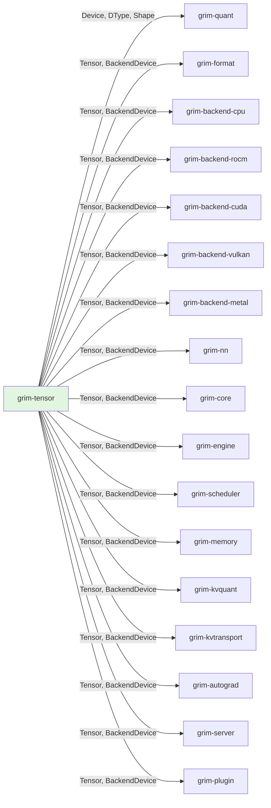

# grim-tensor

Core tensor, DType, Shape, Device abstractions and backend-agnostic trait surface.

## Purpose

This crate provides the foundational data types for tensor operations across all Grim backends. It defines the `Device` enum, `DType` system with quantization support, `Shape` abstraction, and the `BackendDevice`/`BackendStorage`/`ComputeHandle` trait surface that backends implement.

## Boundaries

- Does not perform actual computations — only defines types and traits
- Does not include backend-specific code (see `grim-backend-cpu`, `grim-backend-rocm`, etc.)
- Does not serialize/deserialize model weights (see `grim-format`)
- Does not perform quantization (see `grim-quant`)

## Dependency Graph



## Public API

### Device

```rust
pub enum Device {
    Cpu,
    Rocm(usize),
    Vulkan,
    Cuda(usize),
    Metal(usize),
}
```

Hardware compute targets for tensor allocation.

### DType

```rust
pub enum ArithType { F32, F16, BF16, I64, U32, U8 }

pub enum Storage {
    Native,
    KQuant(KQuantScheme),
    GroupInt(GpuIntConfig),
    FloatPack(FloatPackScheme),
    Block(BlockDtype),
}

pub struct DType { pub arith: ArithType, pub storage: Storage }
```

Arithmetic type and physical storage encoding. Supports native formats and multiple quantization schemes.

### BackendDevice

```rust
pub trait BackendDevice: Send + Sync {
    fn zeros(&self, shape: &Shape, dtype: DType) -> Result<Box<dyn BackendStorage>>;
    fn matmul(&self, a: &dyn BackendStorage, b: &dyn BackendStorage, out: &Shape) 
        -> Result<(Box<dyn BackendStorage>, Box<dyn ComputeHandle>)>;
    fn add(&self, a: &dyn BackendStorage, b: &dyn BackendStorage, out: &Shape) 
        -> Result<(Box<dyn BackendStorage>, Box<dyn ComputeHandle>)>;
    fn mul(&self, a: &dyn BackendStorage, b: &dyn BackendStorage, out: &Shape) 
        -> Result<(Box<dyn BackendStorage>, Box<dyn ComputeHandle>)>;
    fn rms_norm(&self, x: &dyn BackendStorage, weight: &dyn BackendStorage, eps: f32, out: &Shape) 
        -> Result<(Box<dyn BackendStorage>, Box<dyn ComputeHandle>)>;
    fn softmax(&self, x: &dyn BackendStorage, out: &Shape) 
        -> Result<(Box<dyn BackendStorage>, Box<dyn ComputeHandle>)>;
    fn embedding(&self, weight: &dyn BackendStorage, indices: &[u32], out: &Shape) 
        -> Result<(Box<dyn BackendStorage>, Box<dyn ComputeHandle>)>;
    fn rope(&self, x: &dyn BackendStorage, positions: &[u32], dim: usize, base: f32, out: &Shape) 
        -> Result<(Box<dyn BackendStorage>, Box<dyn ComputeHandle>)>;
    // ... more ops
}
```

### ComputeHandle

```rust
pub trait ComputeHandle: Send {
    fn synchronize(&self) -> Result<()>;
    fn is_ready(&self) -> bool;
}

pub struct ReadyHandle; // For synchronous backends
```

Track async compute operation completion.

### Tensor

```rust
pub struct Tensor { /* private fields */ }
```

High-level tensor type wrapping `BackendStorage`.

## Usage Example

```rust
use grim_tensor::{Device, DType, Shape, Tensor};

// Create a CPU tensor
let shape = Shape::new(vec![1, 384]);
let data: Vec<f32> = vec![0.0; 384];
let tensor = Tensor::from_vec(data, shape, DType::F32, Device::Cpu);

// Or create zeros
let zeros = grim_backend_cpu::cpu_zeros(&shape, DType::F32);
```

## Error Type

```rust
pub enum Error {
    Shape(String),
    DType(String),
    Device(String),
    Unimplemented(String),
}
pub type Result<T> = std::result::Result<T, Error>;
```

## Edge Cases, Limitations, and Quirks

1. **Device::Vulkan ordinal()**: Returns `None` because Vulkan doesn't use device ordinals like ROCm/CUDA/Metal
2. **BackendDevice defaults**: Many methods return `Err(BackendDevice::Unimplemented)` as defaults — backends must override to support the operation
3. **Quantization**: `Storage::KQuant` includes `IQ4NL`, `IQ2XS`, etc. from llama.cpp compatibility — these require dequant kernels
4. **Thread safety**: `BackendDevice` requires `Send + Sync`; implementations must ensure thread-safe access to device state

## Crate-Specific Build Flags

This crate has no feature flags or environment variables.